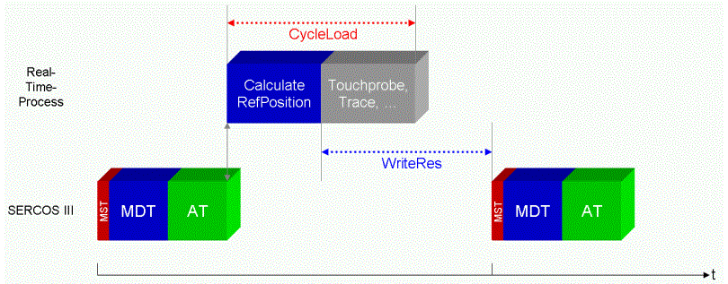

# CycleLoad

## General

|  |  |
| --- | --- |
| Type | AF |
| Devices supporting the parameter | PacDrive LMC x00C,  PacDrive LMC x01C |
| Traceable | Yes |

## Functional Description

The parameter CycleLoad indicates the used capacity [%] of the PacDrive controller by the real-time process. Generally, it is a good practice to keep the cycle load to a value that allows for some overhead processing for tasks such as fieldbus server, network communications and other program related tasks. Usually, peak loads of short durations do not pose a significant degradation of performance. However, if there is insufficient overhead reserved for tasks performed outside of the cycle, you could receive a diagnostic message. This condition could result in the loss of data.

| NOTICE | |
| --- | --- |
|  | LOSS OF DATA  Ensure that your cycle timing allows for processing that occurs outside of the cycle.  Failure to follow these instructions can result in equipment damage. |

CycleLoad is a variable for evaluating the system load.

Relationship between CycleLoad and WriteRes

The real-time process (RTP) is an important system task. It enables the execution of the real-time tasks at the correct time. Real-time processing is triggered by the Sercos real-time bus during each [bus cycle](D-SE-0073362_1.html#D-SE-0073362). Processing is then performed in the following steps.

## Step 1 (Blue)

* Preparation of the cycle
* Initializing of measuring variables and monitoring
* Acceptance of the real-time data provided by the most recent drive telegrams (DTs) of the Sercos slaves
* Processing of the master encoders such as Virt. Master Encoder and physical master encoders (Venc, PhyEnc, and Inc)
* The logical encoders, Sum encoder (SLAVE\_ENCODERS (LEnc, Summ, MSumm))
* The axes

  + Perform diagnostics status
  + Status machine of the drives
  + Real-time job preparation
  + POS and CAM generators (master and slave curves)...
  + New reference values are now available
  + The data is transmitted in the master data telegram (MDT) in the next cycle
* The reference values are transferred for transmission in the next cycle

## Step 2 (Grey)

The remaining real-time functions, such as

* Touchprobe
* Trace, and so on.

Certain externally event-controlled tasks and also high-priority  can adversely affect the execution of the real-time process. Monitoring the variables [CycleLoad](#D-SE-0073268), [RTBReadRes](D-SE-0073269.html#D-SE-0073269), and [RTBWriteRes](D-SE-0073270.html#D-SE-0073270) allows the evaluation of the dynamic behavior.

EIO0000002285.11