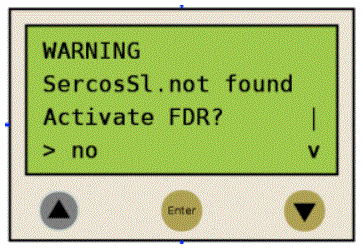
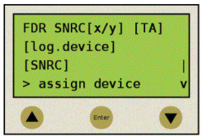
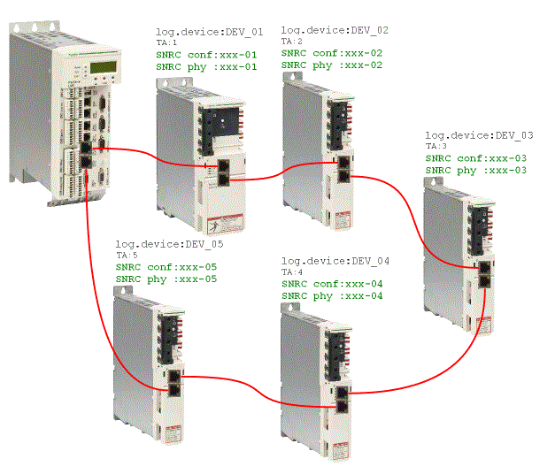
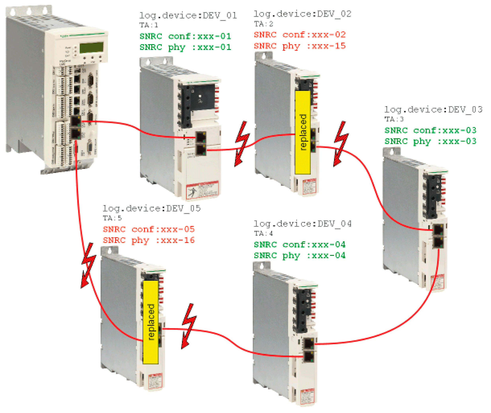
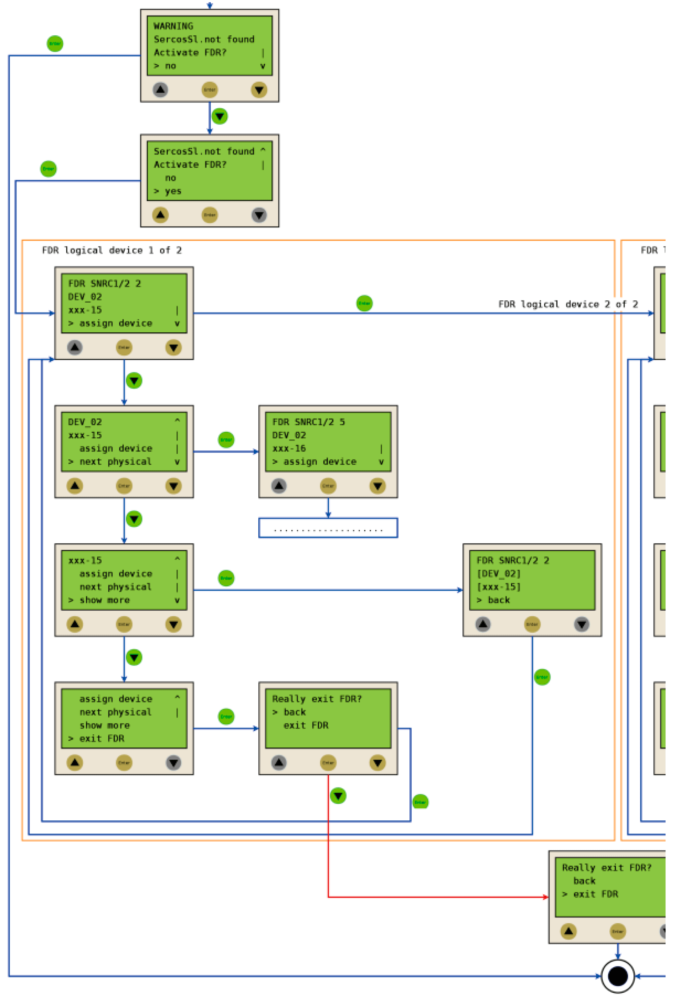
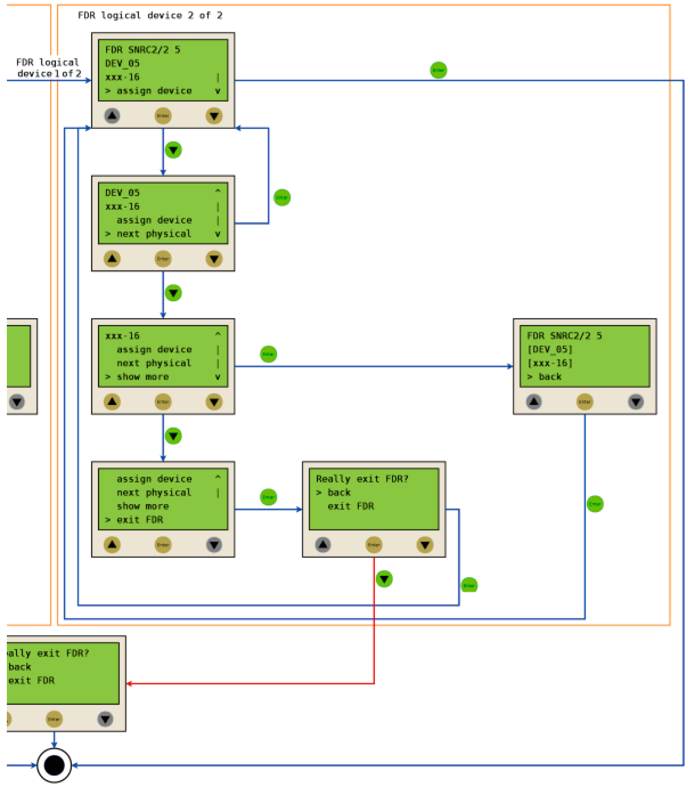

# Fast Device Replacement (FDR) Through the Controller Display

## Contents of This Topic

This topic contains the following subtopics:

* [Overview](#D-SE-0073355__D-SE-0073355.2)
* [Requirements](#D-SE-0073355__D-SE-0073355.4)
* [Usage](#D-SE-0073355__D-SE-0073355.6)
* [Controller Display](#D-SE-0073355__D-SE-0073355.12)
* [Application](#D-SE-0073355__D-SE-0073355.13)

## Overview

If devices are replaced which are addressed through their serial number (Identification mode -> Device serial number, SerialNumberController / 0, also refer to IdentificationMode and [Device addressing](D-SE-0088091_1.html#D-SE-0088091)), errors are detected during phasing up of Sercos because the old and the new device inevitably have different serial numbers.

Even if the devices are addressed through their application type (Identification mode-> Application type, ApplicationType / 3 ) or their Sercos address (Identification mode -> Sercos address, SercosAddress / 4 ), errors may be detected during phasing up of Sercos.

In such cases, you can manually manage the assignment of logical devices in the logic controller configuration (Logic Builder) to the physical devices through the controller display.

After you have acknowledged the assignment of a replaced device through the controller display, the system performs the following, depending on the type of addressing:

* The serial number of the physical device is written to the parameter ConfiguredSerialNumber of the logical device in the logic controller configuration.
* The application type or the Sercos address is written to the corresponding parameter of the affected device.

The modifications are retained after a restart. If the controller is restarted after a successful device assignment, the parameters have the values as modified through the controller display (also refer to [Behavior after repeated download](#D-SE-0073355__D-SE-0073355.11)).

The information is saved to the memory card of the PacDrive LMC x00C or the PacDrive LMC x01C (device serial number, also refer to [FC\_SysSaveParameter](../../../../../api/crossBook?lang=en-US&virtualBookName=PD.Lib.SystemInterface&topicID=D_SE_0085355) and [FC\_SysSaveParByLogAddr)](../../../../../api/crossBook?lang=en-US&virtualBookName=PD.Lib.SystemInterface&topicID=D_SE_0085357), or to the respective device (application type/Sercos address).

After you have assigned the replaced devices through the controller display, the assignment is verified during phasing up of Sercos.

## Requirements

The following conditions must be met for an assignment of the logical devices in the logic controller configuration (Logic Builder) to the physical devices through the controller display:

* The devices are addressed in one of the following ways:

  + Serial number (Identification mode -> Device number, SerialNumberController / 0, also refer to IdentificationMode and [Device addressing](D-SE-0088091_1.html#D-SE-0088091))

    NOTE: The value SerialNumberMotor / 1 is not supported for this parameter.
  + Application type (Identification mode -> Application type, ApplicationType / 3 )
  + Sercos address (Identification mode -> Sercos address, SercosAddress / 4)
* The value of the parameter FDRConfirmationMode of the controller is by display / 0 (= default).

NOTE: Take note of the serial number of the new device before installing it because you need it later on for the assignment through the controller display.

## Configuration Parameters

The following parameters of the controller have determine the execution of the FDR function through the controller display:

| Parameter | Description |
| --- | --- |
| FDRStartMode | Determines if and when FDR is performed. |
| FDRState | This parameter is set to in progress / 3 while the FDR function is executed through the controller display. After termination of the FDR function, the parameter is set to idle / 0. |
| FDRConfirmationMode | The value using display / 0 indicates that FDR through the controller display is activated.  The value using parameter / 1 indicates that FDR through the controller display is disabled.  If the value is using parameter / 1, do the following, depending on the condition:   * Write the serial number to be modified to the parameter ConfiguredSerialNumber of the replacement device via an application. * Write the application type or the Sercos address to the replacement device (also refer to [ApplicationType / 3](D-SE-0088238_1.html#D-SE-0088238) and [SercosAddress / 4](D-SE-0088238_1.html#D-SE-0088238)). |

## Usage

If two or more devices of the same type (or a Double drive) are replaced, there is a potential of confusing the manual assignment of a logical device to the corresponding physical device.

| WARNING | |
| --- | --- |
|  | UNINTENDED EQUIPMENT OPERATION  * Make sure that the assignment of the logical devices to the physically connected devices equates exactly the device assignment before the device replacement. * Before commissioning the system, ensure that the logic controls the correct physical devices.  Failure to follow these instructions can result in death, serious injury, or equipment damage. |

## Different Device Types

The FDR display mechanism does not consider the device type of physical devices.

NOTE: If the logical device type does not match the assigned physical device type, a device assignment with the FDR function is possible, but an error is detected during phasing up of Sercos (message 8501 SERCOS slave not found). If FDRStartMode is set to the value “phase up / 2”, the FDR function is restarted.

## Device Replacement

If the requirements are fulfilled (refer to [Requirements](#D-SE-0073355__D-SE-0073355.4)) and you are replacing a device, the controller display shows the start screen.

## Confirmation or Cancelation

You can cancel the FDR function through the controller display using the **Enter** key (if **(> no)** is displayed).

You can activate the FDR function by pressing the **Down** key (**(> yes)** is displayed) and then confirming with the **Enter** key. You can then navigate through the menu as described in [Controller display](#D-SE-0073355__D-SE-0073355.12) (also refer to [Application](#D-SE-0073355__D-SE-0073355.13)).

## Timeout (five minutes)

If no key is pressed on the display for a period of five minutes, the FDR function is terminated. The timeout is reset to zero each time you press a key on the controller display.

## Behavior After Repeated Download

If a project is downloaded after completion of the FDR function through the controller display, the modified value of the parameter ConfiguredSerialNumber is reset to the value contained in the downloaded project. In the case of devices addressed with Identification mode -> Device number (SerialNumberController / 0) and assigned via FDR, the system acts as if the FDR function through the controller display had not been performed.

## Controller Display

When the FDR function through the controller display is active, the controller display shows the FDR screen.

Refer to [Application](#D-SE-0073355__D-SE-0073355.13) for details on performing FDR through the controller display.

| Item | | Description |
| --- | --- | --- |
|  |  | If **up**/**down** arrow keys are displayed to the right of the screen, you can scroll up and down using these corresponding keys.  Scrolling only starts when the line with the > symbol is displayed at the top or the bottom of the screen. If the > symbol is displayed in a line in between, you can move it using the **up**/**down** arrow keys. |
|  |  |
|  | - | The command in the line that is highlighted with the > symbol can be confirmed/executed with the **Enter** key. |
|  | - |

In the following example, FDR SNRC stands for addressing a device using the device serial number. Instead of FDR SNRC, you can also select FDR ATYP (for application type) or FDR SADR (for Sercos address).

| Placeholder | Description |
| --- | --- |
| [x/y] | Number of the logical device to be assigned (x) and total number of devices to be assigned (y).  If, for example, 20 unassigned devices were found and you already finished assigning 11 devices, 12/20 is displayed. |
| [TA] | Topological address of the display physical device. |
| [log.device] | Name of the logical device in the logic controller configuration (Logic Builder) that is to be assigned to the physical device at the topological address [TA]. |
| [SNRC] | Serial number of the displayed physical device on the topological address [TA]. |

NOTE: If a line contains more than 18 characters, the first 16 characters are followed by "..". The command Details allows you to display the full content of the line (see below).

NOTE: Devices assigned via the command Assign device (see below) cannot be unassigned.

| Command | Description |
| --- | --- |
| Assign device | This command confirms the assignment of the logical device [log.device] to the physical device at the topological address [TA].   * In the case of Identification mode > Device serial number, the serial number of the physical device is copied to the parameter ConfiguredSerialNumber of the logical device. * In the case of Identification mode > Application type, the application type is written to the corresponding device. * In the case of Identification mode > Sercos address, the Sercos address is written to the corresponding device.   After you have assigned a device, the x number (see placeholder [x/y]) is increased. If there are no more unassigned devices, FDR is terminated and Sercos phase-up continues. |
| Next phys. | This command displays the next physical device for the logical device to be processed. |
| Details | This command displays the full information about an item in several lines. A logical device is displayed with up to 40 characters |
| Back | This command returns to the default view with a maximum of 16 characters followed by ".." per line. |
| Exit FDR | This command cancels the FDR function. The cancelation has to be confirmed. |

## Application

The following example shows a typical application of the FDR function performed through the controller display.

**Initial conditions**

* The Sercos bus has phased up.
* The devices are addressed via the serial number (Identification mode > Device serial number, SerialNumberController / 0).
* The value of the parameter FDRConfirmationMode is Display / 0.

**Device replacement**

The following devices are to be replaced:

* The device at the topology address 2 (TA:2) with the logical device name DEV\_02 and the serial number SNRC phy: xxx-02 is to be replaced by the new device with the serial number SNRC phy: xxx-15.
* The device at the topology address 5 (TA:5) with the logical device name DEV\_05 and the serial number SNRC phy xxx-05 is to be replaced by the new device with the serial number SNRC phy xxx-16.

**After the device replacement**

After the physical replacement of the devices, the machine is to be restarted. For the FDR function through the controller display to start, the parameter FDRStartMode has to be set to boot / 1 or to phase up / 2 and the parameter FDRConfirmationMode has to be set to using display / 0.

The FDR function now has to determine the correct assignment of the two logical devices DEV\_02 and DEV\_05 to the new physical devices at topology addresses 2 and 5.

**Procedure**

The FDR function identifies the logical devices which would trigger the message “8501 SERCOS slave not found” during regular Sercos phase-up without FDR. Then, the physical devices are offered for assignment to a given logical device until you confirm one of these physical devices as the replacement device.

Procedure for device 1 and device 2:

EIO0000002285.11