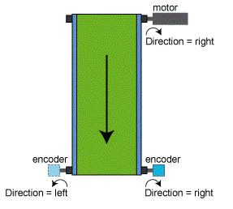

# Direction

## General

|  |  |
| --- | --- |
| Type | EF |
| Devices supporting the parameter | SinCos Encoder Input  Incremental Encoder Input  Encoder network (Synchronization encoder input, Synchronization encoder output) |
| Traceable | Yes |

## Functional Description

Defines the direction of rotation.

The direction of rotation is taken into consideration in the parameters InitPosition and Velocity. A negative direction of rotation causes the absolute position to be reflected within its range of representation.

NOTE: Corruption of the velocity signal during a change of Direction. The velocity signal is briefly corrupted, which can cause other errors. Only change the parameter value at encoder standstill. Maintain the standstill for at least the set [filter time](D-SE-0075783.html#D-SE-0075783).

| Value | Data type | Meaning |
| --- | --- | --- |
| left / 0 | BOOL | In counterclockwise direction (looking at the shaft). |
| right / 1 | BOOL | In clockwise direction (looking at the shaft). |

Parameter Direction using the example of the conveyor belt

EIO0000002285.11