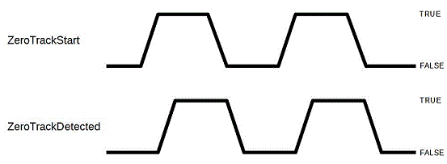

# ZeroTrackStart

## General

|  |  |
| --- | --- |
| Type | EF |
| Devices supporting the parameter | Incremental Encoder Input |
| Traceable | Yes |

## Functional Description

Enables the zero track detection.

A rising edge of this parameter (switch-over from "false / 0" -> "true / 1") activates the zero track detection on the incremental encoder input.

A falling edge of this parameter (switch-over from "true / 1" -> "false / 0") deactivates the zero track detection on the incremental encoder input.

Only if the zero track detection has been reset, another zero track detection can be carried out.

Zero track detection evaluates the level of the incremental encoder's zero track.

| Value | Data type | Meaning |
| --- | --- | --- |
| false / 0 | BOOL | Zero track detection disabled. |
| true / 1 | BOOL | Zero track detection enabled. |

NOTE: When a zero track occurs, the HW immediately sets the internal increment counter to 0. In the next SERCOS cycle Position and Velocity are corrected. This is not important when you are using the Zero Track as a reference. When you are using the Zero Track for a highly cyclic activity, the slight deviation in velocity can cause the position to deviate.

The position results from the current counter status.

Velocity is taken from the previous velocity since the current value is not available. As a result, the position derived from the velocity is slightly inaccurate.

EIO0000002285.11