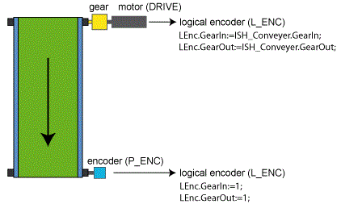

# GearIn

## General

|  |  |
| --- | --- |
| Type | EF |
| Devices supporting the parameter | Log. encoder |
| Traceable | Yes |

## Functional Description

Displays the gear box input (numerator). This only affects the velocity (Parameter Velocity) of the master encoder; it does not affect OffsetVelocity. The velocity of the master encoder is multiplied by GearIn and divided by GearOut.

## Example

A conveyor belt is moved by a drive via a transmission. In addition, the machine requires a [cam switch group](D-SE-0077240.html#D-SE-0077240) which for example, controls a blowout valve. The position of the conveyor belt is used as a master position for the cam switch group.

Values for the parameters GearIn and GearOut of the Log. encoder using the example of a conveyor belt with different master encoders

The transmission must be entered into the parameters GearIn and GearOut of the drive, so that the position values are calculated in conveyor belt units (for example, mm).

Furthermore, a Log. encoder is required as a position source for the cam switch group. A master encoder supplies the logical encoder with velocity or position signals. The Log. encoder also has parameters GearIn and GearOut.

The following values must be entered, depending on the master encoder used, into the parameters GearIn and GearOut of the Log. encoder:

* The drive is used as a master encoder.

  In this case, the transmission parameters of the drive must also be entered into the transmission parameters of the Log. encoder.
* A separate physical encoder (for example, SinCos) is fitted to the conveyor belt as master encoder and read in by the controller.

  In this case the transmission parameters of the Log. encoder must be left at the default value: 1.

EIO0000002285.11