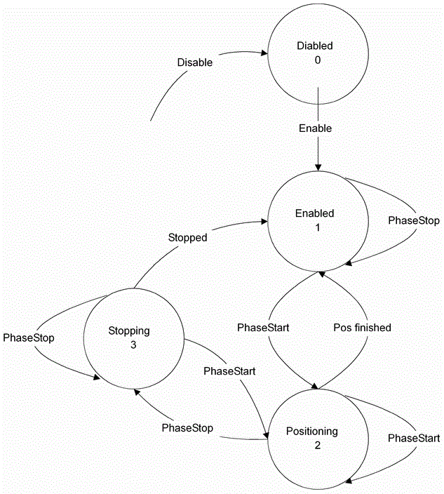

# PhaseState

## General

|  |  |
| --- | --- |
| Type | AD |
| Devices supporting the parameter | Log. encoder |
| Traceable | Yes |

## Functional Description

Displays the status of the phase generator.

PhaseState

EIO0000002285.11