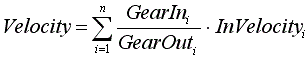

# GearOut

## General

|  |  |
| --- | --- |
| Type | EF |
| Devices supporting the parameter | Sum master encoder input |
| Traceable | Yes |

## Functional Description

Displays the denominator of the gear factor. Evaluates the input velocity.

If a sum master encoder has inputs 1 to n, the output velocity is produced as follows:

EIO0000002285.11