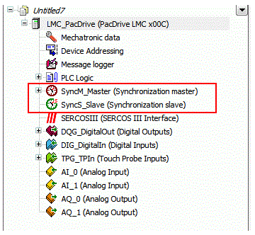

# Controller as Synchronization Master or Slave

## General

In a project, the synchronization master and the synchronization slave can be configured at the same time.

The controller can either be used as synchronization master or as synchronization slave.

The controller can either be used as synchronization master or as synchronization slave.

A controller cannot serve as synchronization master and synchronization slave at the same time.

The on and off switching process of a synchronization master or slave is controlled by the Enable parameter.

Only one synchronization object can be set to TRUE for the Enable parameter.

If a second synchronization object is started, even though another object is enabled already, the following diagnostic message is displayed:

8205 Impermissible parameter value

The reason for the diagnostic message can be determined by using the DiagExtMsg parameter:

* DiagExtMsg: `sync sl is on`

  There was an attempt to enable the master object even though a slave object is or was enabled already.
* DiagExtMsg: `sync ma is on`

  There was an attempt to activate the slave object even though a master object is or was already activated.

NOTE: A synchronization object can only be activated once after the start-up of the controller. This means that, for instance it is not possible to activate and then deactivate a master and afterwards to activate a slave.

EIO0000002285.11