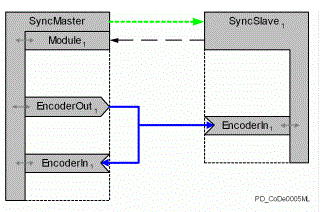

# General

## Description

In order to have the encoder signal of the Synchronization encoder output on the Synchronization master with the same time offset (parameter DataDelay) such as the connected Synchronization slaves, it is possible to attach a Synchronization encoder input here also.

Synchronization encoder input on Synchronization master in the encoder network

EIO0000002285.11