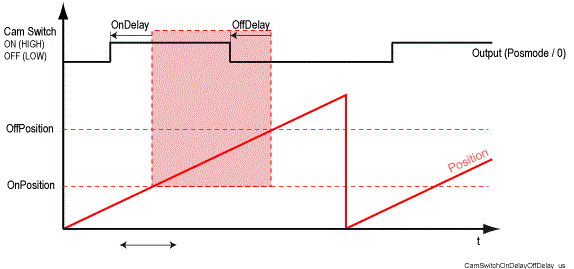

# OffDelay

## General

|  |  |
| --- | --- |
| Type | EF |
| Devices supporting the parameter | Cam Track |
| Traceable | Yes |

## Functional Description

Compensates the response times (dead times) of the actor connected to the output.

If, for example, the actor is a coil, then it should be taken into account that the magnetic field of a coil does not reach its full strength immediatel;likewise, the field does not drop off immediately. These on/off delay times can be taken into account by means of the parameters OnDelay and OffDelay.

Compensates the response times of the actor connected to the output with OnDelay and OffDelay

The basis for considering the response times of the actor is provided by the current velocity of the [position source](D-SE-0077273.html#D-SE-0077273). Here, the velocity is assumed to be constant for one interval of the cam switch group.

OnPositioncompensated = OnPosition - (Velocity \* OnDelay)

OffPositioncompensated = OffPosition - (Velocity \* OffDelay)

EIO0000002285.11