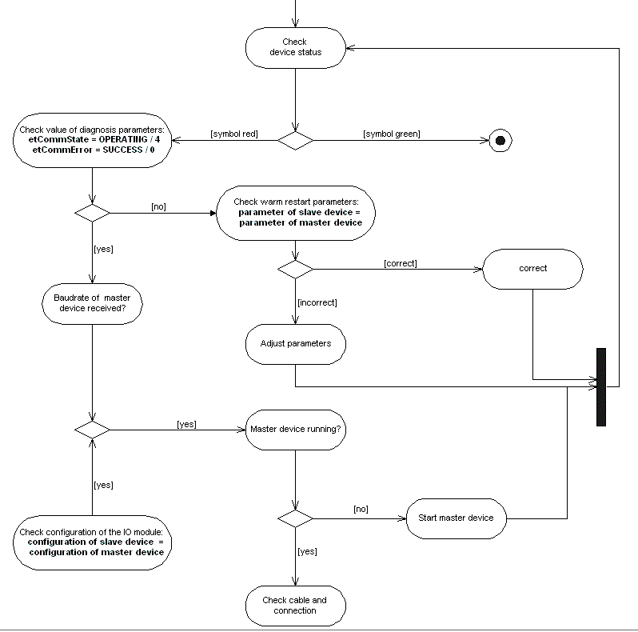

# Diagnostic Scheme

## General

For diagnostic of the PROFIBUS DPV1 slave, the generic editor (device dialog box) can be used. The following diagnostic scheme is an example for a possible debugging procedure.

Diagnostic scheme

EIO0000002285.11