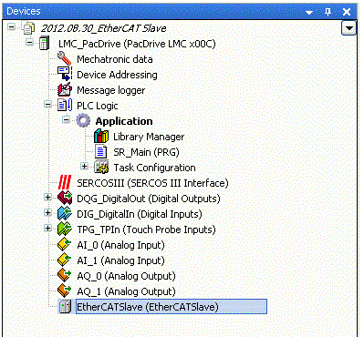

# Add EtherCAT Slave

## General

Proceed as follows to add an EtherCAT-Slave to the Device tree:

| Step | Action |
| --- | --- |
| 1 | Right-click on LMC\_PacDrive on the Device tree. |
| 2 | In the context menu, select "Add device..."  Result: The dialog box Add device opens. |
| 3 | Select the entry <All manufacturers> under Device. |
| 4 | Select the EtherCAT-Slave under Field busses > EtherCAT > Slave. |
| 5 | Confirm with [Add device].  Result: The device is displayed under Sercos on the Device tree. |

EIO0000002285.11