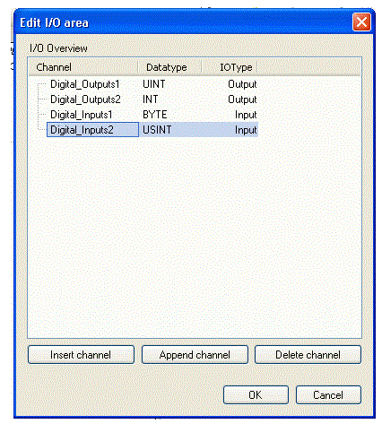
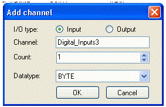

# Edit I/O

## General

| Step | Action |
| --- | --- |
| 1 | Click on the button [Edit I/O] in the [Dialog box](D-SE-0082641.html#D-SE-0082641) General settings.  Result: The dialog box Edit I/O range opens. |

|  |  |
| --- | --- |
| Designation | Description |
| I/O overview | Lists the channels, sorted by outputs and inputs.   * **Channel**  Unambiguous channel name Is automatically entered but it can be changed. * **Data type**  Data type of the input / output. Can be determined when inserting/adding a channel. * **Type (I/O)**  Type of the input / output Can be determined when inserting/adding a channel. |
| [Insert channel] | Opens the dialog box Add I/O channel. See below.  After editing the dialog box and confirming with [OK] the new channel is inserted before the marked channel.  The channels are sorted by outputs and inputs.  Outputs can only be inserted between outputs and inputs only between inputs. |
| [Add channel] | Opens the dialog box Add I/O channel. See below.  After editing the dialog box and confirming with [OK], the new channel is inserted as last input or output.  The channels are sorted by outputs and inputs. |
| [Delete channel] | Deletes the marked channel after confirming a respective dialog box with [Yes]. |
| [OK] | Closes the dialog box. The changes are accepted. |
| [Cancel] | Closes the dialog box without accepting the changes. |

NOTE: For each channel, a variable with the same name is also created; this name, however, can be changed. See EC-Modul I/O Mapping dialog box of the EtherCAT-Slave.

## Add I/O Channel

| Step | Action |
| --- | --- |
| 1 | Click the button [Insert channel] or [Add channel] on the Edit I/O range dialog box.  Result: The dialog box Add I/O channel opens. |

|  |  |
| --- | --- |
| Designation | Description |
| I/O type | Determines whether the new channel is an input or an output. |
| Channel | Unambiguous channel name Is automatically entered but it can be changed. |
| Number | Number of inputs / outputs. The possible values depend on the data type. |
| Data type | Determines the data type of the channel via a drop-down list. |
| [OK] | Closes the dialog box. The changes are accepted. |
| [Cancel] | Closes the dialog box without accepting the changes. |

EIO0000002285.11