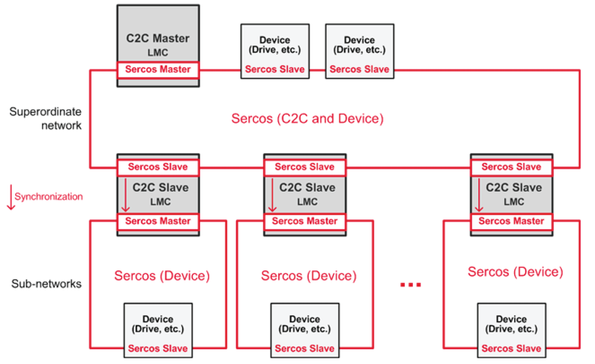

# Architecture

## General Design

Generalized C2C network architecture

The architecture consists of the following two kind of network:

* Superordinate network: Sercos (C2C and Device)

  + Each C2C network consists of one C2C Master and one or several C2C Slaves.
  + The C2C Master acts as Sercos Master in the superordinate network. The C2C Slaves are Sercos Slave devices in the superordinate network.
  + In addition to the C2C Slaves, the superordinate network can also contain other Sercos devices (drives, I/O modules, etc.).
* Sub-networks: Sercos (Device)

  + The Sercos Master of a sub-network is a PacDrive LMC which acts as a C2C Slave in the superordinate network.
  + A sub-network can be used for the communication with other Sercos devices (drives, I/O modules, etc.).

## Boundary Conditions

* Each C2C Slave supports:

  + Up to 116 bytes total for inputs
  + Up to 116 bytes total for outputs
  + Each **C2C Encoder Input** consumes either 8 bytes (if the corresponding **C2C Encoder Output** is on a C2C Slave) or 6 bytes (if the corresponding **C2C Encoder Output** is on a C2C Master).
  + Each **C2C Encoder Output** consumes 6 bytes.
  + Each **C2C Data Input** or **C2C Data Output** consumes as many bytes as defined by the parameter DataSize. (For performance, use even `DataSize` numbers only.)
* Cascaded sub-networks are not allowed. The sub-networks have to be children of the superordinate network (see figure “Generalized C2C network architecture” above).

  This is verified on Sercos phase up of the C2C Master and is signaled with the diagnostic message [8520](D-SE-0064010.html#D-SE-0064010) (**Ext. diagnosis: No Cascading**).
* The Sercos cycle time of the superordinate network must be at least as fast as the Sercos cycle time of the fastest sub-network.

NOTE: There is no limit in the number of consumer objects (for example, **C2C Encoder Input**) for one producer object (for example, **C2C Encoder Output**).

## Supported Controllers

| Build size | Type | Connector |
| --- | --- | --- |
| PacDrive LMC Pro | C2C Master | Use front connector (CN12/CN13) “Sercos”. |
| C2C Slave | Use front connector (CN10/CN11) “RT Ethernet”. |
| PacDrive LMC Eco | C2C Master | Use front connector (CN5/CN6). |
| C2C Slave | With optional EtherNet/IP communication module (VW3E704100000). |

## Requirements

* Minimum required PacDrive LMC firmware version: V1.53.x.x
* Minimum required FPGA version for C2C Slave:

  + PacDrive LMC Pro: 0209
  + PacDrive LMC Eco: 0110

NOTE: The FPGA version is displayed in the parameter ControllerType of the PacDrive LMC or on the Liquid Crystal Display (LCD) of the PacDrive LMC (Line 4, first four digits).

EIO0000002285.11