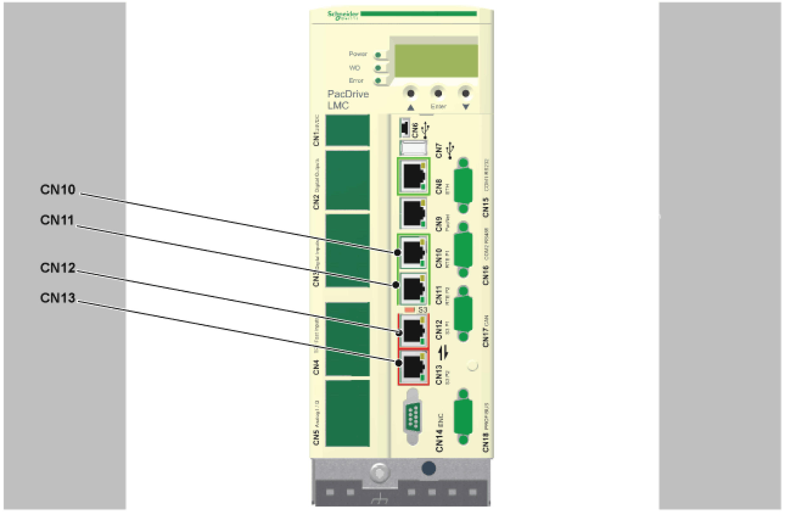
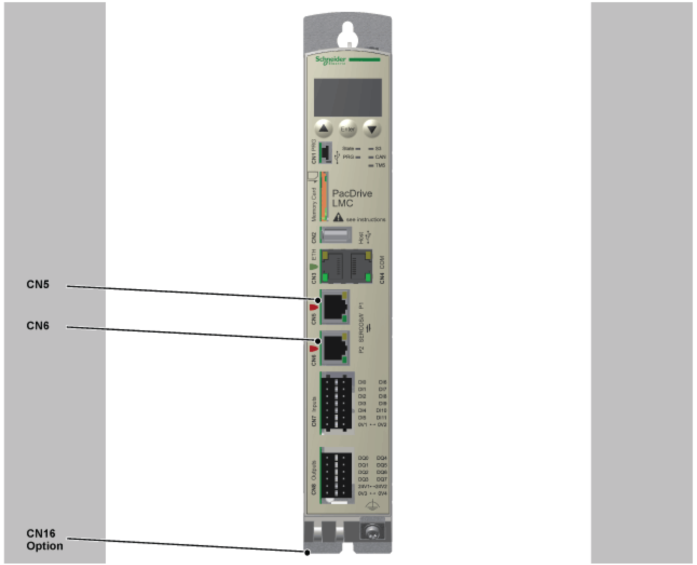
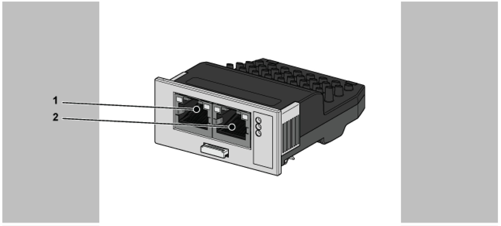

# Electrical Connections

## Description

This section represents the ports which are used for connecting **C2C Master, Sercos Master,** and **C2C Slave.**

## PacDrive LMC Pro

Ports used for C2C Master and C2C Slave

| Connector | Connector description | LMC Pro acting as C2C Slave | LMC Pro acting as C2C Master |
| --- | --- | --- | --- |
| CN10 | Real-time Ethernet, port 1 | Connect C2C Slave to superordinate network, as Sercos Slave | -- |
| CN11 | Real-time Ethernet, port 2 | Connect C2C Slave to superordinate network, as Sercos Slave | -- |
| CN12 | Sercos Master, port1 | Connect C2C Slave to sub-network, as Sercos Master | Connect C2C Master to superordinate network, as Sercos Master |
| CN13 | Sercos Master, port2 | Connect C2C Slave to sub-network, as Sercos Master | Connect C2C Master to superordinate network, as Sercos Master |

## PacDrive LMC Eco

Ports used for C2C Master and C2C Slave

| Connector | Connector description | LMC Eco acting as C2C Slave | LMC Eco acting as C2C Master |
| --- | --- | --- | --- |
| CN5 | Sercos Master, port 1 | Connect C2C Slave to sub-network, as Sercos Master | Connect C2C Master to superordinate network, as Sercos Master |
| CN6 | Sercos Master, port 2 | Connect C2C Slave to sub-network, as Sercos Master | Connect C2C Master to superordinate network, as Sercos Master |
| CN16 Option | Slot for optional communication module | Connect VW3E704100000 (Communication Module Realtime Ethernet) | -- |

## Communication Module Realtime Ethernet

Ports used for C2C Slave

| Connector | Connector description | VW3E704100000, on LMC Eco used as C2C Slave | VW3E704100000, on LMC Eco used as C2C Master |
| --- | --- | --- | --- |
| 1 | Real-time Ethernet | Connect C2C Slave to superordinate network, as Sercos Slave | -- |
| 2 | Real-time Ethernet | Connect C2C Slave to superordinate network, as Sercos Slave | -- |

EIO0000002285.11