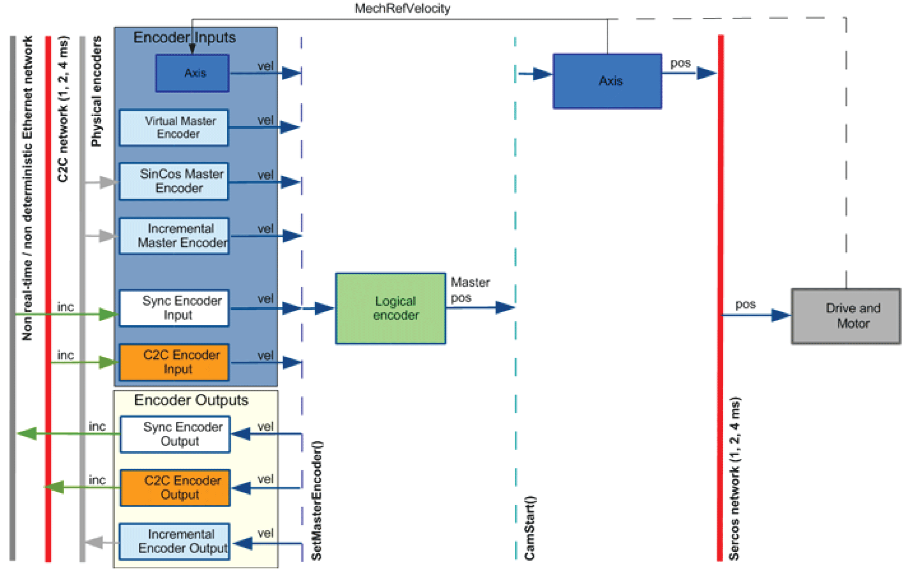

# Encoder Data Transfer

## Description

In the PacDrive3 system, different velocity sources (encoder inputs) can be coupled o a logical encoder or other encoder outputs using the function FC\_SetMasterEncoder. An encoder input coupled to a logical encoder in combination with a motion generator (for example, CamStart) can be used to move an axis in relation to the encoder input signal.

To exchange encoder signals across different PacDrive LMCs in a C2C network, two C2C data objects (**C2C Encoder Input** and **C2C Encoder Output**) are used. With these objects, a coupling of encoder signals can be executed.

Motion data flow

* If different Sercos cycle times are used on the way between encoder output and encoder input, the encoder signal is automatically extrapolated for the encoder input.

  The same extrapolation is executed if there are non consecutive data errors due to Sercos telegram data losses.
* For each encoder input, a parameter DataValid signals whether the encoder object receives valid values.
* An encoder output can be connected to one or many encoder input objects. These encoder inputs will deliver synchronous values with equal delay over the entire C2C network.

  To use the delayed encoder signal on the same controller that produces the signal, an encoder output and encoder input object with the same ID can be inserted in the same project.
* The delay to the original signal is available through the parameter DataDelay.

  To get synchronized signals in the entire C2C network, each Sercos encoder input implements a FIFO (First In First Out) to buffer the position for the necessary amount of cycles.

EIO0000002285.11