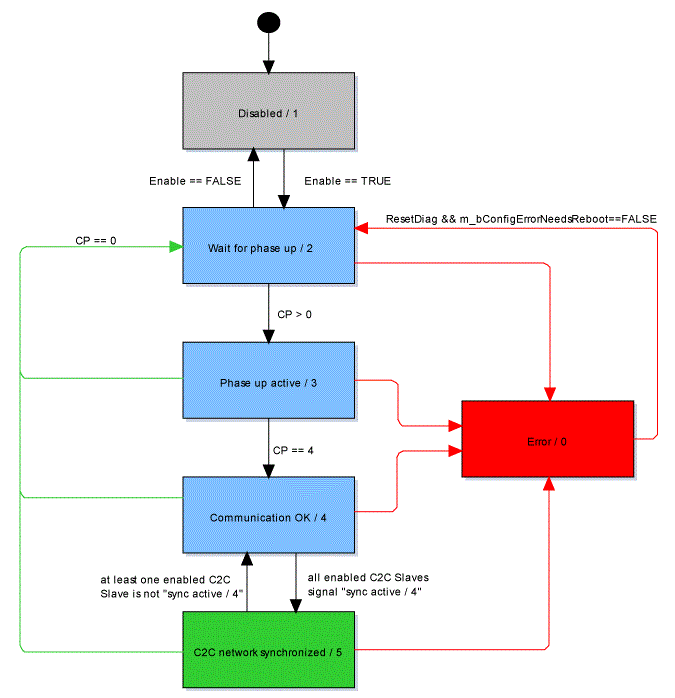

# SyncGroupState

## General

|  |  |
| --- | --- |
| Type | AD (C2C\_Master), AF (C2C\_Slave) |
| Devices supporting the parameter | C2C\_Master, C2C\_Slave |
| Traceable | Yes |

## Functional Description

Displays information on the synchronization between C2C Master and the participating C2C Slaves in the C2C network as reflected in the parameter SyncGroupState.

The following table describes the different states:

| Value | Data type | Meaning |
| --- | --- | --- |
| error / 0 | DINT | An error was detected.  Details on the detected error are displayed with diagnostic parameters and entries in the message logger. |
| disabled / 1 | DINT | The C2C Master / Slave object is disabled. The C2C network functionality is not active. |
| wait for phase up / 2 | DINT | Waiting until the local Sercos Master (C2C network) is starting its Sercos phase up ([communication phase](D-SE-0073356.html#D-SE-0073356): CP > 0). |
| phase up active / 3 | DINT | The local Sercos Master (superordinate network) is phasing up ([communication phase](D-SE-0073356.html#D-SE-0073356): 0 < CP < 4). |
| communication OK / 4 | DINT | The local Sercos Master (superordinate network) is operational in [communication phase](D-SE-0073356.html#D-SE-0073356) 4.  The communication with the C2C Slaves is established. The C2C Slaves are executing their internal synchronization. |
| C2C network synchronized / 5 | DINT | The C2C Slaves of the C2C network synchronized their sub-network (parameter SyncState = Synchronized / 5). The C2C network is operational. |

Flow chart of parameter SyncGroupState

EIO0000002285.11