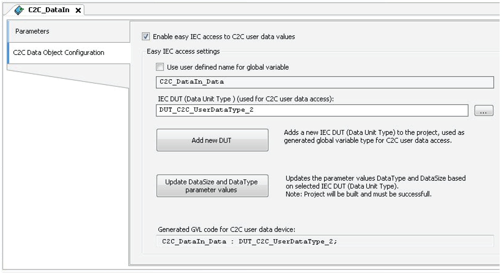
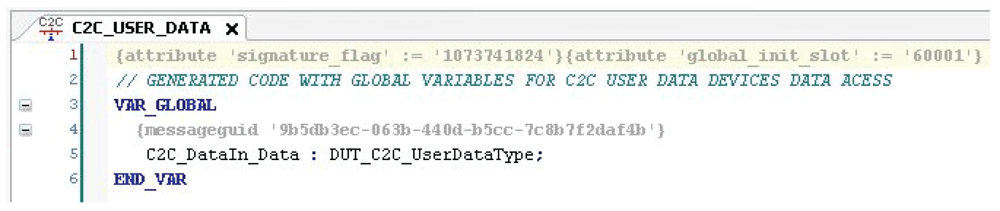
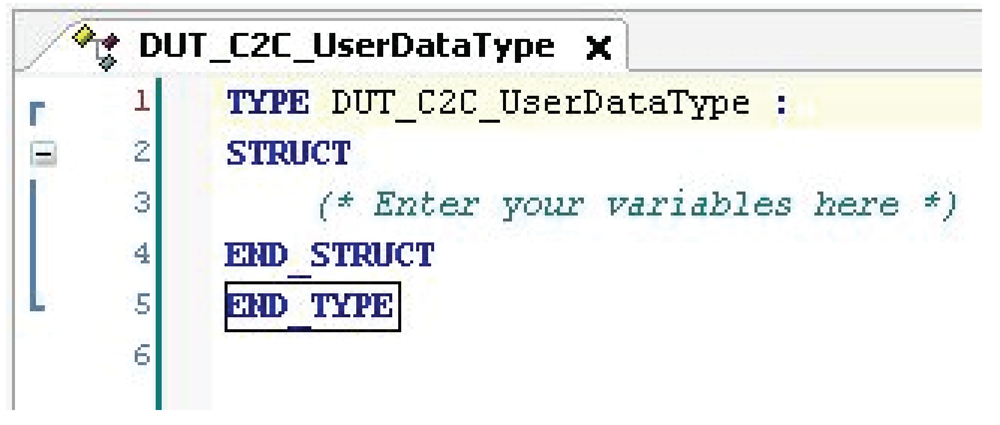

# C2C Data Object Configuration

## Overview

With the **C2C Data Object Configuration** tab you can configure the C2C data input and output objects (**C2C Data Input**, **C2C Data Output**).

The tab allows you:

* To define the names of generated global variables.
* To create Data Unit Types (DUT) automatically and map them to C2C data objects.
* To use DUTs to access C2C user data in a structured way.

## C2C Data Object Configuration Tab

| Element | Description |
| --- | --- |
| **Enable easy IEC access to C2C user data values** | Checkbox to enable / disable the features provided by this tab. |
| **Use user-defined name for global variable** | Checkbox deactivated: The name of the global variable is generated automatically.  Checkbox activated: You can edit the name of the global variable. |
| **IEC DUT (Data Unit Type)** | Name of the DUT used for the generated global variable and mapped to C2C user data memory area. The browse button opens the **Input Assistant** to select a DUT. |
| **Add new DUT** button | Adds a new DUT to the project. |
| **Update DataSize and DataType parameter values** button | Updates the parameter values DataSize and DataType based on the selected DUT.  NOTE: The project must be successfully built. |
| **Generated GVL code for C2C user data device** | Generated global variable code. |

## How to Use the C2C Data Object Configuration (Example)

| Step | Action |
| --- | --- |
| 1 | Select the **C2C\_Master** (**C2C\_Slave**) and add a **C2C Data Input** device.  Result: Automatically the **C2C\_USER\_DATA** object is added beneath the **Application** node. |
| 2 | Double-click the **C2C\_DataIn** device.  Result: The device editor opens. |
| 3 | Select the **C2C Data Object Configuration** tab. |
| 4 | Activate the **Enable easy IEC access to C2C user data values** checkbox. |
| 5 | Either deactivate the **Use user defined name for global variable** checkbox, to create the name of the global variable automatically.  Or activate the checkbox if you want to edit the name. |
| 6 | Either click the **Add new DUT** button if you want to define a new DUT, or select an existing DUT using the browse button.  Result: A new DUT (**DUT\_C2C\_UserDataType (STRUCT)**) is added to your project. |
| 7 | Click the **Update DataSize and DataType parameter values** button.  Result: The parameter values DataSize and DataType of the added DUT are updated.  NOTE: The project must be successfully built. |

## C2C\_USER\_DATA (Example)

* If you are not logged in to the controller, the **C2C\_USER\_DATA** window displays the generated global variables.
* If you are logged in to the controller, the **C2C\_USER\_DATA** window displays the online values of the generated global variables.

## DUT\_C2C\_UserDataType (STRUCT) (example)

## Update all C2C Data Object Parameters

To update the parameters of the C2C data input and output objects (**C2C Data Input**, **C2C Data Output**) below a **C2C\_Master** (or a **C2C\_Slave**), right-click the master (or slave) and select **Update all C2C Data object parameters** from the contextual menu.

EIO0000002285.11