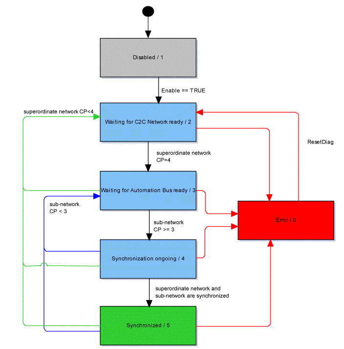

# SyncState

## General

|  |  |
| --- | --- |
| Type | AD |
| Devices supporting the parameter | C2C\_Slave, Logic Motion Controller Device |
| Traceable: | Yes |

## Functional Description

Displays information on the synchronization between superordinate network and sub-network of this C2C slave.

The following table describes the different states:

| Value | Data type | Meaning |
| --- | --- | --- |
| Error / 0 | DINT | An error has been detected.  Details on the detected error are displayed with diagnostic parameters and entries in the message logger. |
| Disabled / 1 | DINT | The **C2C Slave** object is disabled. |
| Waiting for C2C Network ready / 2 | DINT | Waiting until the superordinate network delivers a stable synchronization signal in [communication phase](D-SE-0073356.html#D-SE-0073356) 4. |
| Waiting for Automation Bus ready / 3 | DINT | Waiting until the sub-network is ready to be synchronized (at least [communication phase](D-SE-0073356.html#D-SE-0073356) 3). |
| Synchronization ongoing / 4 | DINT | The system is operational. The synchronization of superordinate network and sub-network is active. |
| Synchronized / 5 | DINT | The sub-network and the superordinate network are synchronized. |

Flow chart of parameter SyncState

EIO0000002285.11