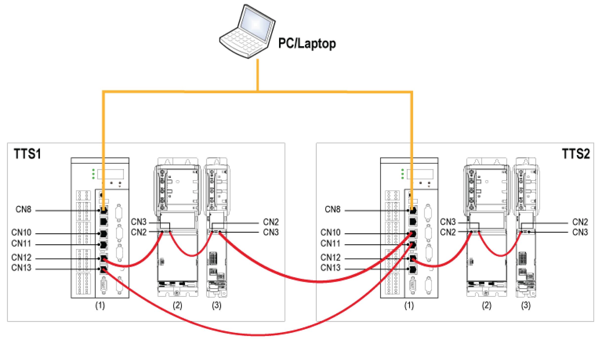

# Hardware Setup

## Description

One training test system (TTS) acts as C2C Master (hereinafter referred to as TTS1). The other TTS acts as C2C Slave (hereinafter referred to as TTS2).

Each TTS consists of the following devices:

* a PacDrive LMC
* a PacDrive LMC600
* a Lexium 62 Double Drive
* two servo motors

## Wiring the Test Training Systems

The following figure represents two test training systems connected via Sercos:

**1** PacDrive LMC

**2** PacDrive LMC600

**3** Lexium 62 Double Drive

To wire the two test training systems TTS1 and TTS2, proceed as follows:

* Verify, that the devices at the TTS1 and at the TTS2 are wired as follows:

  Sercos cable from PacDrive LMC **(CN12)** connected to PacDrive LMC 600 **(CN2)**. Sercos cable from PacDrive LMC 600 **(CN3)** connected to Lexium 62 Double Drive **CN2**.
* Open Sercos loop (at the TTS1 and TTS2):

  If Lexium 62 Double Drive **(CN3)** is connected to PacDrive LMC **(CN13)**, remove the Sercos cable.
* C2C network wiring of TTS1 and TTS2:

  Wire Lexium 62 Double Drive of TTS1 **(CN3)** to PacDrive LMC of TTS2 **(CN10)** to insert the PacDrive LMCof TTS2 into the Sercos loop of TTS1.
* Close the Sercos loop (optional step):

  Wire PacDrive LMC of TTS2 **CN11** to PacDrive LMC of TTS1 **CN13**.
* Connect the connection cable of each TTS to the main connection using an isolating transformer.

  For important safety and technical information related to isolating transformers, refer to "Operating Manual, Training- and Application-Test-System PacDrive 3 TTS 3 (Commissioning > Connecting and switching on)".
* Apply power to each TTS via the mains switch.
* Ethernet connection to PC/laptop:

  Connect PacDrive LMC **(CN8)** of each TTS via Ethernet cable to the same network in which the PC/laptop is located that you use for programming.

EIO0000002285.11