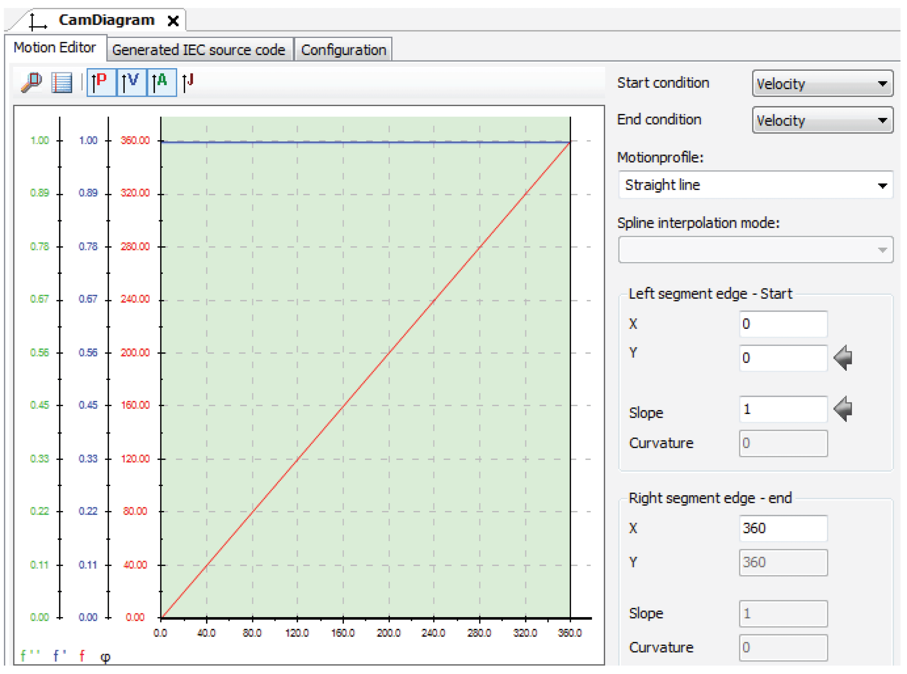

# Adding Library and Cam Diagram to C2C Slave Project

## Description

To process the encoder signal sent by the C2C Master LMC and to carry out the same motion as the motor of the C2C Master (TTS1) the *PDL.FB\_MultiCam* function block and a 1:1 CAM profile are used in the C2C Slave project.

## Adding Library PD\_PacDriveLib

Add the [PD\_PacDriveLib](../../../../../api/crossBook?lang=en-US&virtualBookName=PD.Lib.PacDriveLib&topicID=D_SE_0090101) library to the C2C Slave project to use the FB\_MultiCam function block.

## Adding Linear Cam Diagram

Add a new linear cam diagram to the **Application** node of the C2C Slave project and apply the following settings to **Segment (#1)**:

| Section/field | Settings |
| --- | --- |
| **Start condition** | Velocity |
| **End condition** | Velocity |
| **Motionprofile** | Straight line |
| **Left segment edge - Start** | |
| **X** | 0 |
| **Y** | 0 |
| **Right segment edge - End** | |
| **X** | 360 |
| **Y** | 360 |

EIO0000002285.11