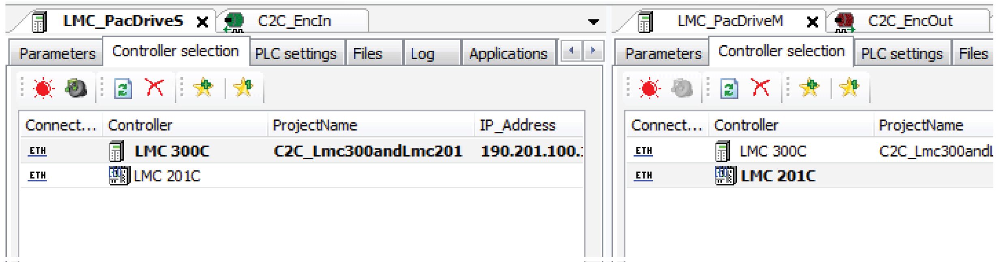
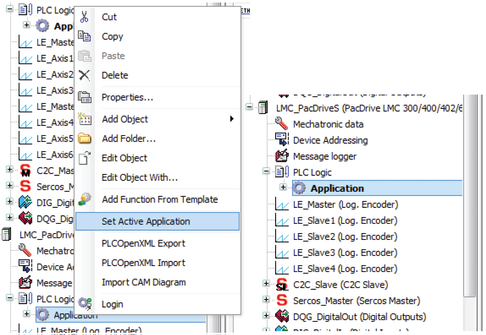
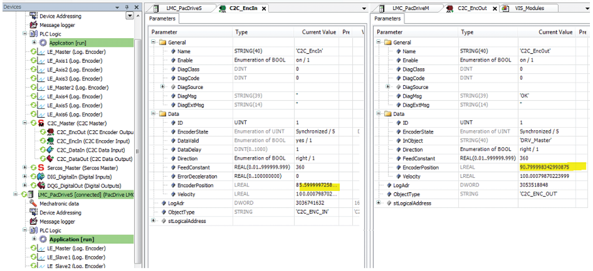

# With EcoStruxure Machine Expert

## Overview

In EcoStruxure Machine Expert there are two different ways to access Schneider Electric controllers in a C2C network.

* Create 2 EcoStruxure Machine Expert projects and use 2 instances of EcoStruxure Machine Expert. See [One EcoStruxure Machine Expert project per controller](#D-SE-0088167__D-SE-0088167.3).

* Create 1 EcoStruxure Machine Expert project with 2 controllers in the same project. Refer to section [Two (or more) controllers in the same EcoStruxure Machine Expert project](#D-SE-0088167__D-SE-0088167.4).

In both cases you can log in to both controllers at the same time by using the C2C network.

## Case 1: One EcoStruxure Machine Expert Project Per Controller

With one project per controller, you can log in to the controllers without moving your cable.

You open two instances of EcoStruxure Machine Expert, open one project per instance, and log in.

Controller selection and log in is the same as you are used to from other projects.

## Case 2: Two (or More) Controllers in the Same EcoStruxure Machine Expert Project

With two (or more) controller applications in the same EcoStruxure Machine Expert project you can:

* Select the active application.
* Compile different applications at the same time.
* Log in to different applications in parallel.
* Download the project to different controllers at the same time.
* Monitor the parameters of different controllers simultaneously.

## Example (for Case 2)

In the **Controller selection** example, the master is called **LMC\_PacDriveM (LMc 201C** and the slave is called **LMC\_PacDriveS (LMC 300C)**.

Controller selection tabs of the master and slave controllers

## Selecting the Active Application

Before you can execute commands on an application (for example, **Build** or **Login** commands), you have to select one of the available applications in the EcoStruxure Machine Expert project as the active application. To achieve this, right-click the **Application** node and select Set Active Application from the contextual menu or execute the command Project  > Set Active Application. The active application is marked as bold in the tree structure.

## Generate Code for Several Applications at the Same Time

To compile several applications of an EcoStruxure Machine Expert project at the same time, execute the command Build > Generate Code for all Applications.

## Login

Right-click the desired **Application** and select **Login** from the contextual menu.

You can log in to several applications in parallel.

## Multiple Download

To download the project to several controllers at the same time, execute the command Online > Multiple Download, and select the applications to be downloaded from the list.

## Monitoring Different Controllers Simultaneously

When you are logged in to your controllers, you can monitor the parameters of different controllers simultaneously.

EIO0000002285.11