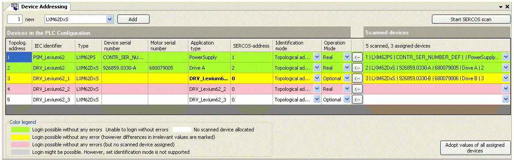

# Device Addressing

## Description

* Double-click the object Device addressing in the devices view to open the editor.

* Right-click on an object directly below the Sercos III object in the Devices view and select Device addressing from the context menu.

Logic Builder, Device Addressing editor

| Designation | Description |
| --- | --- |
| **Devices of the PLC Configuration** | The [left part of the editor window](D-SE-0088124.html#D-SE-0088124) displays the axes and power supply units of the PLC Configuration in the Logic Builder project. |
| **Identification mode** | Using the [Identification mode](D-SE-0088128.html#D-SE-0088128) you specify which criterion is to be used to automatically assign a Sercos device to an object in the PLC Configuration.  NOTE: If you change a value in this column while pressing and holding the shift key, all values of this column are set to this value. |
| **OperationMode** | The [operating mode](D-SE-0088130.html#D-SE-0088130) is used to determine the way this device is to be operate.  NOTE: If you change a value in this column while pressing and holding the shift key, all values of this column are set to this value. |
| **[Start Sercos scan]** button | Click this button to [start searching](D-SE-0088133.html#D-SE-0088133) for real, physical axes and network devices that are connected to the Sercos bus. |
| **Scanned devices** | After performing a scan, the [right part of the editor window](D-SE-0088125.html#D-SE-0088125) displays the real, physical axes and network devices that are connected to the Sercos bus.  The column header shows the number of axes scanned and the number of devices assigned automatically.  All devices that were assigned automatically are highlighted in a [non-white color](D-SE-0088131.html#D-SE-0088131). You can manually change the automatic assignment later on by using a selective list in the right-most column. |
| **<---** | Click this button to [apply the values](D-SE-0088127.html#D-SE-0088127) of the Sercos device assigned in this row. |
| **Adopt values of all assigned axes** | After having assigned all axes and power supplies, click this button to [apply](D-SE-0088127.html#D-SE-0088127) the device data of the scanned Sercos devices in the assigned objects in the PLC Configuration. |
| **[Add]<number> new <device(s)>** | Click this button to [add a certain number of new devices to the PLC Configuration](D-SE-0088132.html#D-SE-0088132). |

NOTE: The functions of the editor Device addressing are only available in offline mode.

EIO0000002285.11