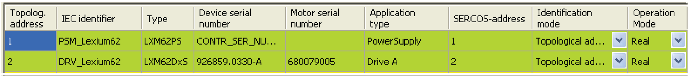
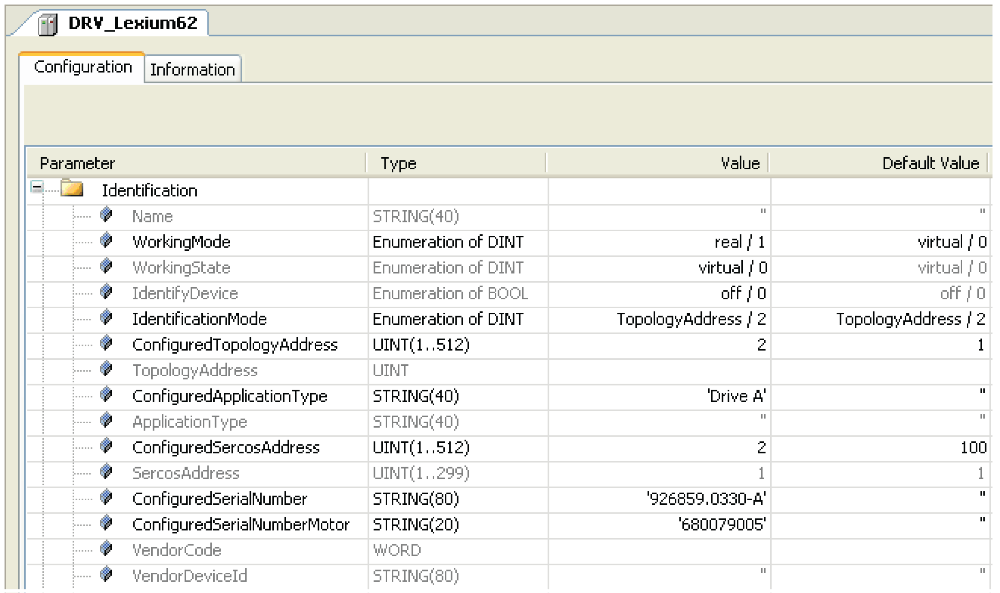

# Axes in the PLC Configuration

## Description

The left part of the [editor](D-SE-0088091.html#D-SE-0088091) displays the PLC configuration parameters required for commissioning. Each row represents a Sercos object in the Logic Builder PLC Configuration. The current values of the object are displayed.

Logic Builder, **Axes in the PLC Configuration**

The original parameter name is displayed in brackets in the tooltip shown when you move the cursor over a column header.

You can change the values in this [editor](D-SE-0088091.html#D-SE-0088091) **(Device Addressing)**as well as in the editor pertaining to a specific object (under **Identifcation**).

Logic Builder, **Configuration (Identification)**

## Order of Sercos Objects

If the Sercos objects are assigned automatically, they are listed in the order of their topological address, starting with the lowest value. If Sercos objects from a previous scan are already listed, any further Sercos objects are added at the end of the list, in the order of the topological address, starting with the lowest value.

NOTE: If the double line topology is used and if a Lexium LXM62 Drive is connected to the port P2, the axis B is assigned prior to axis A as axis B has a lower topology address.

EIO0000002285.11