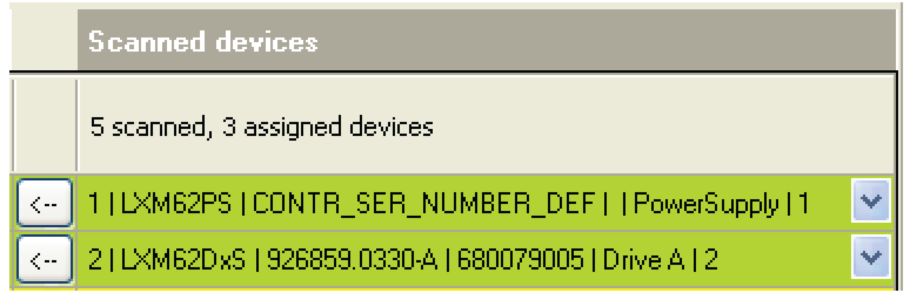
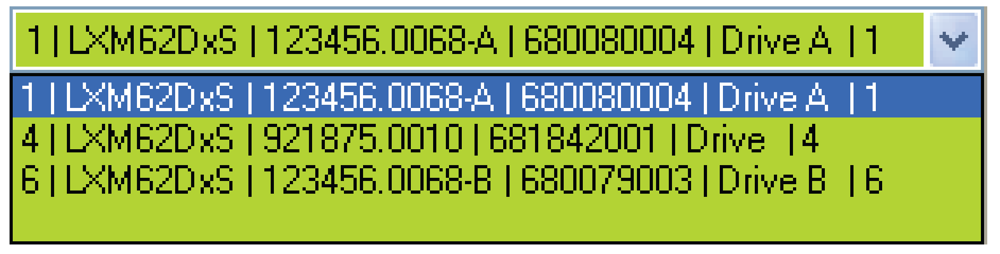

# Scanned Devices

## Description

After [scanning](D-SE-0088133.html#D-SE-0088133) (**[Start]** Sercos scan) the program attempts to assign Sercos objects from the PLC Configuration to the devices connected to the Sercos bus by using the [Identification mode](D-SE-0088128.html#D-SE-0088128). All devices that were assigned automatically are highlighted in a [non-white color](D-SE-0088131.html#D-SE-0088131).

Logic Builder, **Scanned devices**

The column header shows the number of axes scanned and the number of devices assigned automatically.

You can manually change the automatic assignment later on via a selective list in the right-most column.

* Click the **[v]** button in the row you want to change.

  Result: The drop-down list displays all Sercos devices of this type that have not been assigned yet.

* Select the desired device from the list.

NOTE: You can use the empty row at the bottom of the list to reset an assignment.

Logic Builder, list of Sercos devices

Each row of the selection list contains a short description of a Sercos device.

The values are separated by a vertical bar (**“l”**).

They correspond to the following parameters (from left to right):

* TopologyAddress

* ObjectType

* SerialNumber

* SerialNumberMotor (only for axes - otherwise empty)

* ConfiguredApplicationType

* SercosAddress

EIO0000002285.11