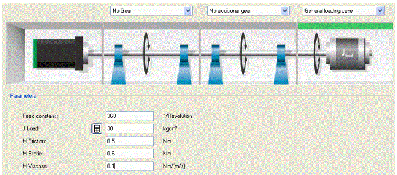
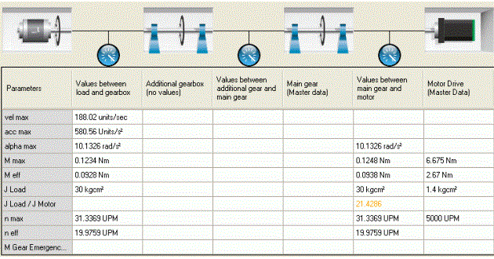

# Overview

## Integrated Engineering - Mechanical Data

One of the key benefits of EcoStruxure Machine Expert is the ability to exchange mechatronic data.

Thus, information will be preserved during transition between disciplines (mechanics, software, electronics). You do not have to acquire data from a preceding step in the machine design cycle by re-engineering.

This holds true especially for mechanical data, which are obtained at an early stage of engineering.

In EcoStruxure Machine Expert, mechanical data are acquired primarily using the Motion Builder tool.

In the **Mechanical design** dialog box, initial data are defined.

This data will be re-used for controller parameterization of the axis in Logic Builder.

## Mechanical Data in Motion Builder

There are two points in time when mechanical data will be available for an axis in Motion Builder:

* When entering data in the **Mechanical design** dialog box:

Motion Builder, **Mechanical design** dialog box

* After calculating the drive sizing:

Motion Builder, dialog box after calculation

At both points in time information for the mechatronic database is processed and transferred.

In Logic Builder this information will then be displayed in an overview in the **Mechatronic data** [dialog box](D-SE-0088042.html#D-SE-0088042).

## Non-Linear FeedConstant

NOTE: Currently, data cannot be determined (in Motion Builder) for the following mechanics as these have a non-linear FeedConstant:

* Crank mechanics with rotary motion

* Crank mechanics with linear motion

In the “Mechatronic data” view in Logic Builder, “0” will be displayed for the parameters for these axes.

## Gearbox factor

In Motion Builder, the gear factor is specified as a floating-point number.

In Logic Builder, for reasons of accuracy, the gear factor for the axis controller is denoted as the quotient of two integers.

NOTE: As a result of this, the transformation of the gear factor from Motion Builder to Logic Builder is subject to a constraint of accuracy: Motion Builder gear factors with a maximum of 9 digits can be transferred to Logic Builder.

NOTE: Additionally, it is not possible in Motion Builder to display the gear factor as a quotient in the “1/3” format (with GearOut/GearIn).

EIO0000002285.11