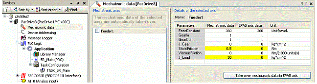

# Mechatronic Data

## Description

Logic Builder, **Mechatronic data dialog box**

| Name | Description |
| --- | --- |
| **Feeder 1 (Mechatronic axes** | If an axis is checked, the mechatronic data for this axis will automatically be synchronized. |
| **Details of the selected axis** | This table lists the data from the mechatronic model (**Mechatronic data**) and compares them to the current data **Logic Builder axis data**) stored in the parameters of the axis in Logic Builder (Logic Builder axis data).  If values in two related fields differ from another, the corresponding lines will be highlighted in yellow. |
| **[Take over mechatronic data to EPAS axis]** button | This button is used to [apply data](D-SE-0088044.html#D-SE-0088044). |

EIO0000002285.11