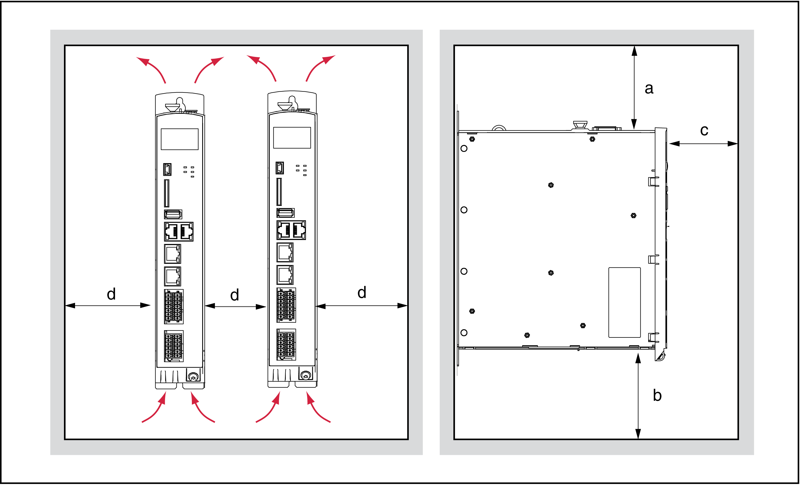
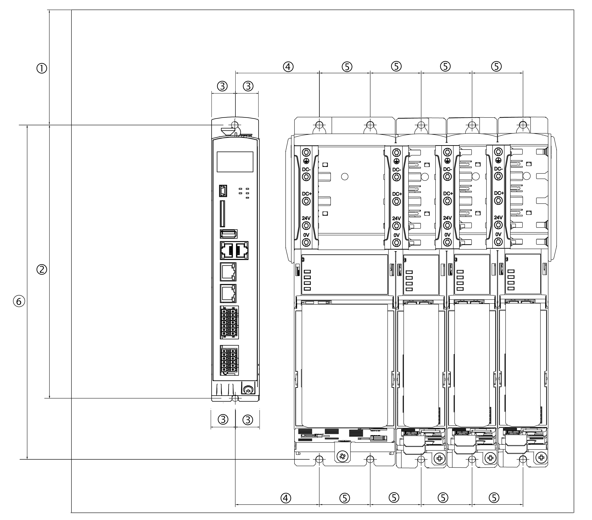

# Preparing the Control Cabinet

## Overview

| DANGER | |
| --- | --- |
|  | INCORRECT OR UNAVAILABLE GROUNDING  Remove paint across a large surface at the installation points before installing the devices (bare metal connection).  Failure to follow these instructions will result in death or serious injury. |

| Step | Action |
| --- | --- |
| 1 | If necessary to maintain and respect the maximum ambient operating temperature, install additional fan in the control cabinet. |
| 2 | Do not block the fan air inlet of the product. |
| 3 | Keep a distance of at least 100 mm (3.94 in) above and below the products. |
| 4 | Mount the controller vertically inside the control cabinet. |

## Assembly Distances, Ventilation

Assembly distances and air circulation:

| Distance | Air circulation |
| --- | --- |
| a ≥ 100 mm (3.94 in) | Clearance above the device. |
| b ≥ 100 mm (3.94 in) | Clearance below the device. |
| c ≥ 60 mm (2.36 in) | Clearance in front of the device. |
| d ≥ 0 mm (0 in) | Clearance between the devices or between the device and the side of the enclosure. |

## Required Distances

Required distances in the control cabinet for the PacDrive LMC Eco, Lexium 62 Power Supply, Lexium 62 Servo Drive:

| – | mm | in | Thread |
| --- | --- | --- | --- |
| (1) | 100 (± 0.2) | 3.94 (± 0.01) | M6 |
| (2) | 258 (+ 0.5 / -0) | 10.16 (± 0.02 / -0) | M6 |
| (3) | 22 (± 0.2) | 0.87 (± 0.01) | M5 |
| (4) | 55 (± 0.2) | 2.17 (± 0.01) | M6 |
| (5) | 45 (± 0.2) | 1.77 (± 0.01) | M6 |
| (6) | 296 (+ 0.5 / -0) | 11.65 (± 0.02 / -0) | M6 |

NOTE: For the shield plates (external shield connections), additional holes are required.

EIO0000001501.10