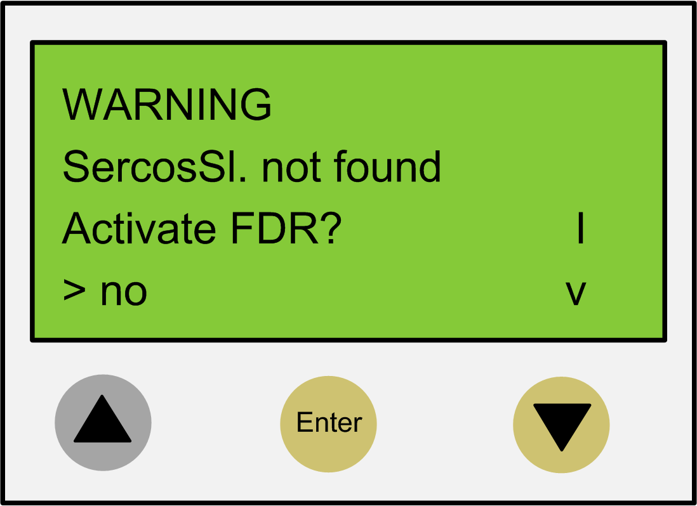

# Fast Device Replacement - Usage

## Error Detected During the Manual Device Assignment

If two or more devices of the same type (or a double drive) are replaced, it is possible that an incorrect manual assignment of the logical devices to the physical connected devices is made.

| WARNING | |
| --- | --- |
|  | UNINTENDED OPERATING STATE OF THE DEVICE  * Ensure that the assignment of the logical devices to the physical connected devices is exactly the same as the device assignment before the device replacement. * Verify that the application addresses the physical drives correctly before putting the machine back into service.  Failure to follow these instructions can result in death, serious injury, or equipment damage. |

## Different Device Types

The controller interface for FDR does not consider the device type of physical devices.

NOTE: If the logical device type is not the same as the assigned physical device type, then a device assignment with the controller interface for FDR is possible. However, it leads to an error being detected during the Sercos phase start-up (8501 Sercos slave not found). If `FDRStartMode` is set to the value `Phase start-up/2`, then the controller interface for FDR is restarted.

Further information on the parameters can be found under *Fast Device Replacement* in the online help of EcoStruxure Machine Expert.

## Device Replacement

If the requirements are fulfilled (see chapter *Fast Device Replacement* in the EcoStruxure Machine Expert online help) and you are replacing a device, then the controller display automatically shows the start picture of the controller interface for FDR.

## Confirmation or Cancel

| Action | Result |
| --- | --- |
| You can exit the controller interface for FDR with the Enter key (if the arrow pointing right is on No). | The controller interface for FDR is canceled. |
| You can also switch to Yes with the arrow pointing down key (arrow pointing right on Yes), and then confirm the Yes with Enter. | Now you can navigate through the menu like described in the chapter [*Controller Display*](D-SE-0049392.html#D-SE-0049392). For more information, refer to the chapter [*Application*](D-SE-0049393.html#D-SE-0049393). |

## Timeout (5 Minutes)

If no button is pressed at the display for 5 minutes, the controller interface for FDR is terminated. The system then behaves as if you have terminated the FDR mechanism. If you press a display button within the 5 minutes, the time for the timeout is reset.

## Behavior After Repeated Download

If after the controller interface for FDR a download of a project is made, then the saved changes of the parameter `ConfiguredSerialNumber` are reset and set to the values that are saved in the project that was downloaded.

For devices that are identified via Identification mode > Device number (`SerialNumberController /` 0) and were allocated via FDR, the system acts as if the controller interface for FDR had not been performed.

Further information on the parameters can be found under *Fast Device Replacement* in the online help of EcoStruxure Machine Expert.

EIO0000001501.10