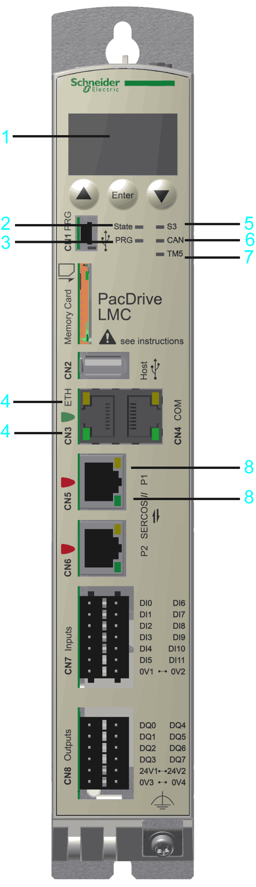
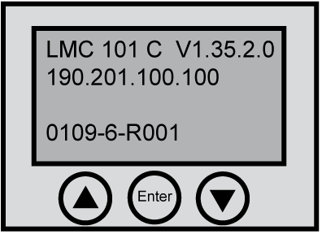

# Indicators of the Controller

## Overview

Operating unit of the PacDrive LMC Eco

|  |  |
| --- | --- |
| 1 | [Liquid Crystal Display (LCD)](#D-SE-0049395__D-SE-0049395.3) |
| 2 | [**State** LED indicator](#D-SE-0049395__D-SE-0049395.4) |
| 3 | [**PRG** LED indicator](#D-SE-0049395__D-SE-0049395.5) |
| 4 | [Ethernet status LED indicators](#D-SE-0049395__D-SE-0049395.9) |
| 5 | [**S3** (Sercos III) LED indicator](#D-SE-0049395__D-SE-0049395.6) |
| 6 | [**CAN** LED indicator](#D-SE-0049395__D-SE-0049395.7) |
| 7 | [**TM5** LED indicator](#D-SE-0049395__D-SE-0049395.8) |
| 8 | [Sercos status LED indicators](#D-SE-0049395__D-SE-0049395.10) |

## Liquid Crystal Display (LCD)

In addition to the LED indicators, further information about the operating status of the controller is given on the 4-line Liquid Crystal Display (LCD).

|  |  |
| --- | --- |
| Line 1 | Controller type and firmware version |
| Line 2 | Current IP address of the controller |
| Line 3 | – |
| Line 4 | PFPGA version/SFPGA version/BIOS version |

## **State** LED Indicator

The **State** LED indicator indicates whether a control voltage is applied, whether errors are detected by the controller and whether the controller performs a minimum boot.

| LED indicator color / status | Meaning |
| --- | --- |
| Off | The control voltage (24 Vdc) is missing or too low. |
| Green | Normal operation, control voltage in normal range |
| Red | System error detected, error is shown on the display |
| Initialization active **after power-on** |
| An error is detected by the controller **after initialization**, for further information on the detected error, see the message logger. |
| Quickly flashes red | The controller performs a minimal boot |

## **PRG** LED Indicator

The **PRG** LED indicator indicates the state of the USB communication on the programming port (**CN1**).

| LED indicator color / status | Meaning |
| --- | --- |
| Off | No USB communication on the programming port. |
| Green | USB communication detected. |

NOTE: The function to establish a connection to the controller via USB is not implemented.

## **S3** (Sercos III) LED Indicator

The **S3** LED indicator indicates the state and the phases of the Sercos communication.

| LED indicator color / status | Meaning | Instructions/information for the user | Notes |
| --- | --- | --- | --- |
| Off | No Sercos communication | – | – |
| Orange | The device is in a communication phase CP0 up to and including CP3. | – | SERC3.State = 0..3 |
| Green | Sercos communication in communication phase CP4 without error detected. | – | SERC3.State = 4 |
| Red | Detected communication error. | Reset condition: `DiagQuit` | SERC3.State = 11 |

## **CAN** LED Indicator

**CAN** LED indicator is a two-color light-emitting diode (LED), alternating between two states: a run state (green color) and an error state (red color). **CAN** LED indicator colors can be flashing (different sequences), or steady, as described below.

| State | Color display mode | Meaning |
| --- | --- | --- |
| Off | – | No power |
| Flashing green  50 ms/50 ms | The LED indicator repeatedly flashes according to the following sequence: on for 50 ms, then off for 50 ms. | Autobaud detection in progress. |
| Flashing green  200 ms/200 ms | The LED indicator repeatedly flashes according to the following sequence: on for 200 ms, then off for 200 ms | Pre-operational state |
| Flashing green  200 ms/1000 ms | Single flash: The LED indicator flashes according to the following sequence: on for 200 ms, then off for 1000 ms | Stopped state |
| Green | Steady | Operating state. |
| Flashing red | Single flash: The LED indicator flashes according to the following sequence: on for 200 ms, then off for 1000 ms | Limit to trigger diagnostic message reached |
| Double flash: The LED indicator flashes according to the following sequence: on for 200 ms, off for 200 ms, on for 200 ms, then off for 1000 ms | A cyclic checking has detected an error |
| Triple flash: The LED indicator flashes according to the following sequence: on for 200 ms, off for 200 ms, on for 200 ms, off for 200 ms, on for 200 ms, then off for 1000 ms | Synchronization error detected. `no Sync` message received within the configured communication cycle timeout |
| Red | Steady | Bus off |

## **TM5** LED Indicator

NOTE: The **TM5** LED indicator and TM5 connector **CN10** are not implemented.

## Ethernet Status LED Indicators

The Ethernet connector has two LED indicators. One LED indicator is green, the other is yellow.

| LED indicator | State | Meaning |
| --- | --- | --- |
| Green | On | Connection established |
| Green | Flashing | Data traffic |
| Green | Off | No connection, for example, no cable connected, or connected device has no power |
| Yellow | On | 1 GBit/s connection |
| Yellow | On | 100 MBit/s connection |
| Yellow | Off | 10 MBit/s connection |

## Sercos Status LED indicators

Each Sercos connector has two LED indicators. One LED indicator is green, the other is yellow.

| LED indicator | State | Meaning |
| --- | --- | --- |
| Yellow | On | Connection established |
| Off | No cable connected or connected device has no power. |
| Green | On | Active network traffic |
| Off | No active network traffic |

## Protocol-specific Status LED Indicators

LED indicators PROFINET device

| LED indicator | Color | State | Meaning |
| --- | --- | --- | --- |
| **SF** Name in the device drawing: COM 0 | **red / green LED indicator** | | |
| Red | On | * Watchdog timeout * Detected error on a channel. * Detected system error. |
| Red | Flashes at 2 Hz. (for 3 s) | DCP signal service is initiated via the bus. |
| Off | Off | No error. |
| **BF** Name in the device drawing: COM 1 | **red / green LED indicator** | | |
| Red | On | * No configration * Low speed physical link * No physical link |
| Red | Flashes at 2 Hz. | No data exchange |
| Off | Off | No error |
| **LINK**/RJ45 Ch0 & Ch1 | **green LED indicator** | | |
| Green | On | A connection to Ethernet exists. |
| Off | Off | The device has no connection to Ethernet. |
| **RX/TX**/RJ45 Ch0 & Ch1 | **yellow LED indicator** | | |
| Yellow | Flashes | The device sends/receives Ethernet frames. |

EIO0000001501.10