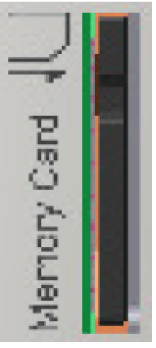
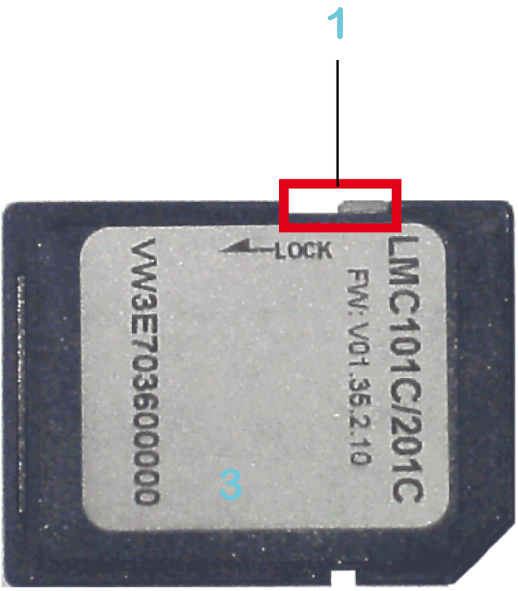
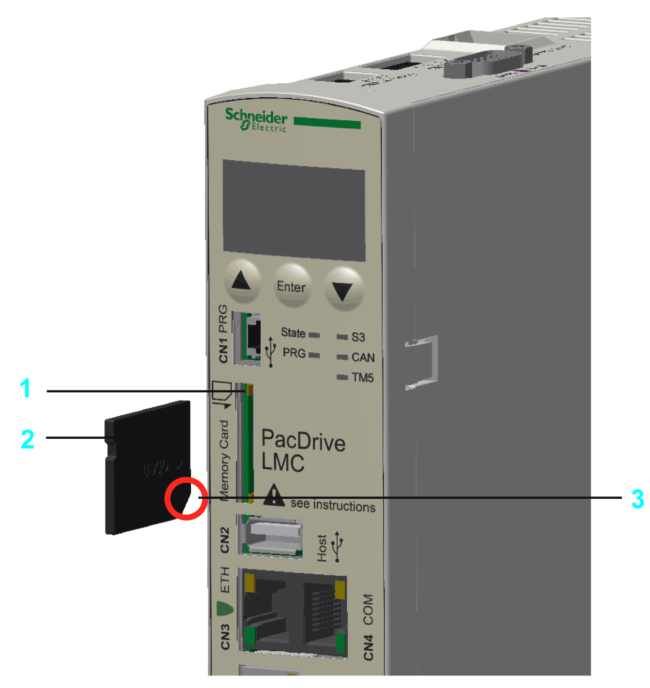

# Memory Card Slot (SD Card)

## Overview

The memory card slot is located on the front side of the controller.

The memory card slot is the receptacle for the non-volatile data storage (the memory card that can be used is an SD card) of the controller.

## General Information on the Memory Card

When handling the memory card, follow these instructions to help prevent a memory card error from occurring, or for internal data on the memory card from being corrupted or lost.

| NOTICE | |
| --- | --- |
|  | LOSS OF APPLICATION DATA  * Do not store the memory card where there is static electricity or probable electromagnetic fields. * Do not store the memory card in direct sunlight, near a heater, or other locations where high temperatures can occur. * Do not bend the memory card. * Do not drop or strike the memory card against another object. * Keep the memory card dry. * Do not touch the memory card connectors. * Do not disassemble or modify the memory card. * Use only memory cards formatted using FAT or FAT32.  Failure to follow these instructions can result in equipment damage. |

| NOTICE | |
| --- | --- |
|  | LOSS OF APPLICATION DATA  * Backup memory card data regularly. * Do not remove power or reset the controller, and do not insert or remove the memory card while it is being accessed.  Failure to follow these instructions can result in equipment damage. |

NOTE: To bridge power outages, use an uninterruptible power supply (UPS) if the data being written to the memory card is critical to your application.

The controller saves data up to 25 ms after a power outage. To help to avoid data loss, use an external UPS.

| NOTICE | |
| --- | --- |
|  | LOSS OF DATA  Use an external UPS to avoid data loss in case of a power outage.  Failure to follow these instructions can result in equipment damage. |

## Function of the Memory Card

The Schneider Electric firmware is stored on the memory card supplied with the controller. After the system start-up, the firmware is loaded on the controller. You can transfer an EcoStruxure Machine Expert project to the memory card. It is also possible to store license points for libraries on the memory card.

NOTE: Only use memory cards supplied by Schneider Electric for this device.

NOTE: There is no display that shows that the memory card has been accessed.

## Write Protection of the Memory Card

With the slide switch on the side of the memory card, the write protection of the memory card can be activated.

**1** Slide switch

To activate the write protection, the slide switch has to be set to the position **LOCK**. To deactivate the write protection, the slide switch has to be set to the opposite position.

NOTE: With an activated write protection, a download of an EcoStruxure Machine Expert project onto the controller or writing of parameters on the memory card is not possible.

## Insert Memory Card

Pre-requisite: The controller must be switched off.

| NOTICE | |
| --- | --- |
|  | INCORRECTLY INSERTED MEMORY card  * Do not insert the memory card when the controller is under power. * Verify that you insert the memory card into the memory card slot correctly with the beveled corner forward and facing downwards.  Failure to follow these instructions can result in equipment damage. |

Insert the memory card carefully into the memory card slot with the beveled corner forward and directed downwards as shown on the figure until it snaps into place:

**1** Memory card slot

**2** Memory card

**3** Beveled corner forward and directed downwards

## Remove Memory Card

Pre-requisite: The controller must be switched off.

| Step | Action |
| --- | --- |
| 1 | Push the memory card slightly inside until it disengages. |
| 2 | Remove the memory card from the memory card slot. |

| NOTICE | |
| --- | --- |
|  | INCORRECTLY REMOVED memory card  Do not remove the memory card when the controller is under power.  Failure to follow these instructions can result in equipment damage. |

EIO0000001501.10