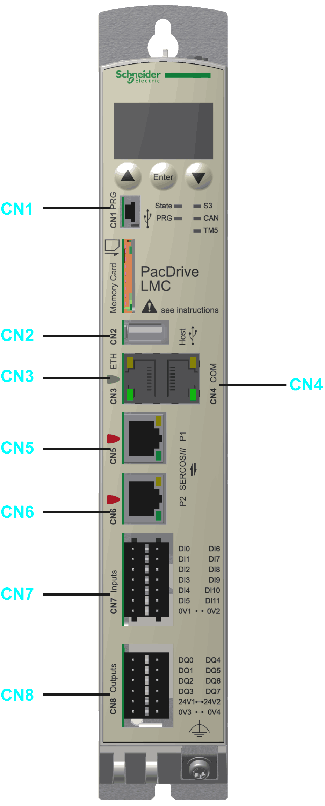
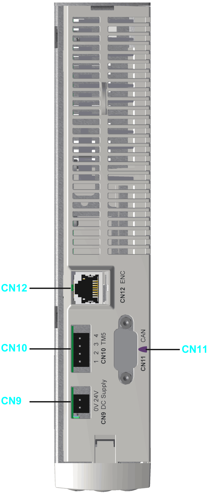
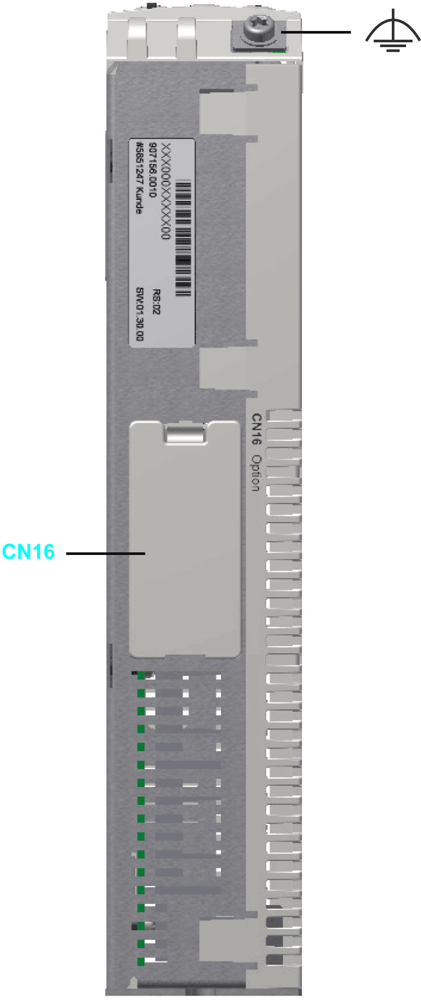

# Electrical Connections Overview

## Front Panel

Connection overview front panel

| Connection | Meaning | Connection cross-section [mm2] / [AWG] | Tightening torque [Nm] / [lbf in] |
| --- | --- | --- | --- |
| **CN1** | Prog port (USB mini-b), not active | – | – |
| **CN2** | USB A | – | – |
| **CN3** | Ethernet connection | – | – |
| **CN4** | Serial link (COM) | – | – |
| **CN5** | Sercos, port 1 | – | – |
| **CN6** | Sercos, port 2 | – | – |
| **CN7** | Digital inputs | 0.2…1.5 / 24...16 | – |
| **CN8** | Digital outputs | 0.2…1.5 / 24...16 | – |

Ferrule dimensions for **CN7**, **CN8**, **CN9**, **CN10**:

| Ferrules without insulating collar (according to DIN 46228-1) | |
| --- | --- |
| Cross-section [mm²] / [AWG] | Length [mm] / [in.] |
| 0.25 / 24 | 7 / 0.28 |
| 0.34 / 22 | 7 / 0.28 |
| 0.5 / 20 | 8...10 / 0.31...0.40 |
| 0.75 / 20 | 8...10 / 0.31...0.40 |
| 1.00 / 18 | 8...10 / 0.31...0.40 |
| 1.50 / 16 | 10 / 0.40 |

| Ferrules with insulating collar (according to DIN 46228-4) | |
| --- | --- |
| Cross-section [mm²] / [AWG] | Length [mm] / [in.] |
| 0.14 / 26 | 8 / 0.31 |
| 0.25 / 24 | 8 / 0.31 |
| 0.34 / 22 | 8 / 0.31 |
| 0.5 / 20 | 8...10 / 0.31...0.40 |
| 0.75 / 20 | 10 / 0.40 |

## Top Side

Connection overview top side

| Connection | Meaning | Connection cross-section [mm2] / [AWG] | Tightening torque [Nm] / [lbf in] |
| --- | --- | --- | --- |
| **CN9** | 24 Vdc | 0.2…1.5 / 24...16 | – |
| **CN10** | TM5 (not active) | – | – |
| **CN11** | CAN | – | 0.4 Nm / 3.54 lbf in |
| **CN12** | Master encoder input | – | – |

## Bottom Side

Connection overview bottom side

| Connection | Meaning | Connection cross-section [mm2] / [AWG] | Tightening torque [Nm] / [lbf in] |
| --- | --- | --- | --- |
| **CN16** | Option | – | – |
|  | Ground (functional earth FE) | minimum 2.5 / minimum 13 | 1.4 / 12.39 |

EIO0000001501.10