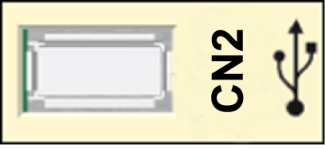
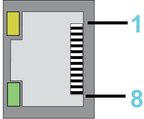
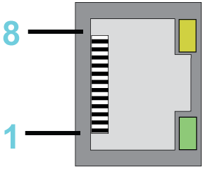
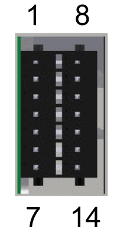
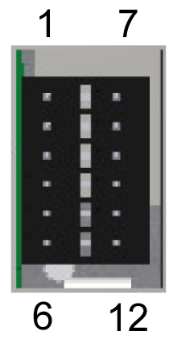
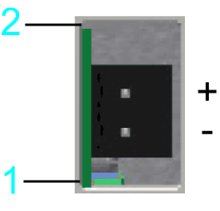
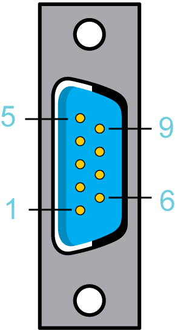
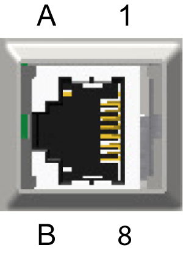

# Connection Details Controller

## **CN1** - Prog Port (USB mini-B)

NOTE: Prog port (USB mini-B) is not active.

## **CN2** - USB-A

Connection **CN2** USB - A

| Pin | Designation | Meaning |
| --- | --- | --- |
| 1 | VBUS / +5V | – |
| 2 | D- / Data- | Data line - |
| 3 | D+ / Data+ | Data line + |
| 4 | GND / Ground | – |

## **CN3** - Ethernet

Connection **CN3**

| Pin | Designation |
| --- | --- |
| 1 | D1 + (Tx+) |
| 2 | D1- (Tx-) |
| 3 | D2+ (Rx+) |
| 4 | D3+ |
| 5 | D3- |
| 6 | D2- (Rx-) |
| 7 | D4+ |
| 8 | D4- |

**CN3** LEDs

| LED | Function | Off | On | Flashes |
| --- | --- | --- | --- | --- |
| Green | State | No connection | Connection, no activity | Connection and activity |
| Yellow | Velocity | 10 MBit | 100 MBit / 1 GBit | – |

## **CN4** - Serial Link (COM)

Connection **CN4**

| Pin | Designation | Meaning |
| --- | --- | --- |
| 1 | TxD | RS-232, transmit data |
| 2 | RxD | RS-232, receive data |
| 3 | CTS | RS-232, clear to send |
| 4 | D1 / B | Modbus D1, RS-485 B |
| 5 | D0 / A | Modbus D0, RS-485 A |
| 6 | RTS | RS-232, request to send |
| 7 | – | Reserved |
| 8 | 0 V | Signal and power common |

## **CN5** - Sercos

Connection **CN5**

| Pin | Designation | Meaning |
| --- | --- | --- |
| 1 | Tx+ | Transmit data + |
| 2 | Tx- | Transmit data - |
| 3 | Rx+ | Receive data + |
| 4 | – | Reserved |
| 5 | – | Reserved |
| 6 | Rx- | Receive data - |
| 7 | – | Reserved |
| 8 | – | Reserved |

The Sercos LEDs indicate the state of the Sercos connection:

| LED | On |
| --- | --- |
| Green | Activity |
| Yellow | Connection |

## **CN6** - Sercos

Connection **CN6**

| Pin | Designation | Meaning |
| --- | --- | --- |
| 1 | Tx+ | Transmit data + |
| 2 | Tx- | Transmit data - |
| 3 | Rx+ | Receive data + |
| 4 | – | Reserved |
| 5 | – | Reserved |
| 6 | Rx- | Receive data - |
| 7 | – | Reserved |
| 8 | – | Reserved |

The Sercos LEDs indicate the state of theSercos connection:

| LED | On |
| --- | --- |
| Green | Activity |
| Yellow | Connection |

## **CN7** - Digital Input

Connection **CN7**

| Pin | Designation | Meaning |
| --- | --- | --- |
| 1 | DI0 | Digital inputs |
| 2 | DI1 |
| 3 | DI2 |
| 4 | DI3 |
| 5 | DI4 |
| 6 | DI5 |
| 7 | 0V1 | Reference potential DI0...DI11 |
| 8 | DI6 | Digital inputs |
| 9 | DI7 |
| 10 | DI8 (FI\_0) | Fast digital inputs |
| 11 | DI9 (FI\_1) |
| 12 | DI10 (FI\_2) |
| 13 | DI11 (FI\_3) |
| 14 | 0V2 | Reference potential DI0...DI11 |

## **CN8** - Digital Output

Connection **CN8**

| Pin | Designation | Meaning | Range |
| --- | --- | --- | --- |
| 1 | DQ0 | – | – |
| 2 | DQ1 | – | – |
| 3 | DQ2 | – | – |
| 4 | DQ3 | – | – |
| 5 | 24V1 | Supply voltage DQ0 - DQ7 | -15% / +25% |
| 6 | 0V3 | Supply voltage DQ0 - DQ7 | – |
| 7 | DQ4 | – | – |
| 8 | DQ5 | – | – |
| 9 | DQ6 | – | – |
| 10 | DQ7 | – | – |
| 11 | 24V2 | Supply voltage DQ0 - DQ7 | -15% / +25% |
| 12 | 0V4 | Supply voltage DQ0 - DQ7 | – |

NOTE: When nothing is connected (or the connected device has a high impedance) to an LMC digital output, it measures ~9V for FALSE. If this causes an issue for the connected device, use an external pull-down resistor.

## **CN9** - Supply Voltage

Connection **CN9**

| Pin | Designation | Meaning | Range |
| --- | --- | --- | --- |
| 1 | 0V | Supply voltage | – |
| 2 | +24V | Supply voltage | -15% / +25% |

## **CN10** - TM5

NOTE: TM5 connection is not active.

## **CN11** - CAN

Connection **CN11**

| Pin | Designation | Meaning |
| --- | --- | --- |
| 1 | – | Reserved |
| 2 | CAN\_L | Bus line (low) |
| 3 | CAN GND | – |
| 4 | – | Reserved |
| 5 | – | Reserved |
| 6 | CAN GND | – |
| 7 | CAN\_H | Bus line (high) |
| 8 | – | Reserved |
| 9 | – | Reserved |

NOTE: A connection of TM5 System via CAN bus and a CANopen interface module is not supported.

## **CN12** - Master Encoder Input (Hiperface)

The Hiperface connection consists of a standard, differential, digital connection (RS-485 = 2 wires), a differential, analog connection (sine- and cosine signal = 4 wires), and a mains connection to supply the encoder (+10V, GND = 2 wires).

Connection **CN12** - Master encoder input (Hiperface)

| Pin | Designation | Meaning |
| --- | --- | --- |
| 1 | COS | Cosine track |
| 2 | REFCOS | Reference signal cosinus |
| 3 | SIN | Sinusoidal trace |
| 4 | RS485+ | Parameter channel + |
| 5 | RS485- | Parameter channel - |
| 6 | REFSIN | Reference signal sine |
| 7 | – | Reserved |
| 8 | – | Reserved |
| A | Encoder supply (+) | – |
| B | GND | – |

## **CN12** - Master Encoder Input (Incremental)

Connection **CN12** - Master encoder input (incremental)

| Pin | Designation | Meaning |
| --- | --- | --- |
| 1 | Trace B+ | – |
| 2 | Trace B- | – |
| 3 | Trace A+ | – |
| 4 | Trace N+ | – |
| 5 | Trace N- | – |
| 6 | Trace A- | – |
| 7 | – | Reserved |
| 8 | – | Reserved |
| A | Encoder supply (+) | – |
| B | GND | – |

EIO0000001501.10