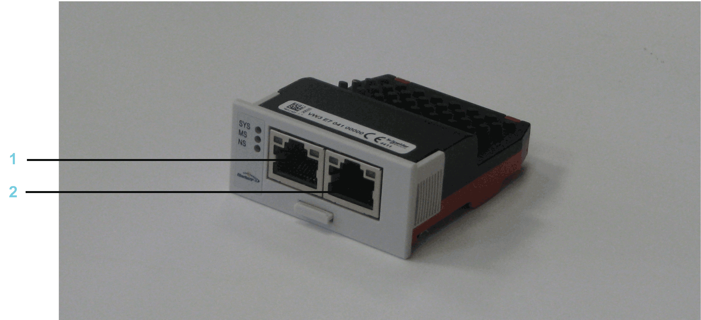
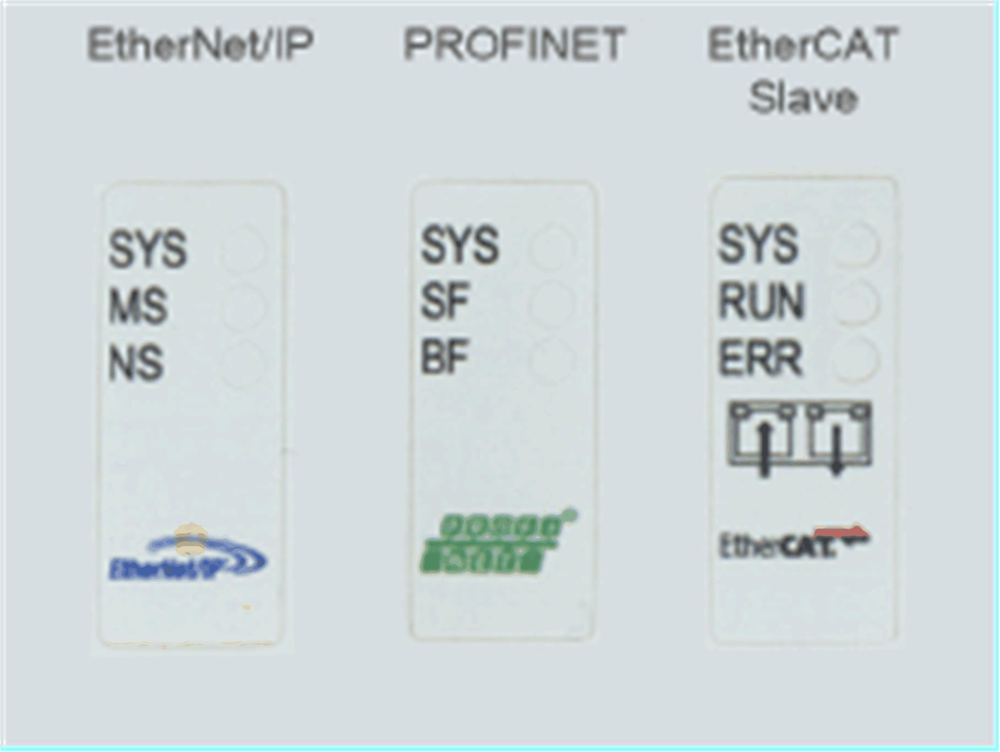

# Overview

## General Information

The communication module Realtime Ethernet is an optional module that provides a PROFINET, EtherNet/IP, EtherCAT, C2C slave or additional standard Ethernet interface.

Communication module Realtime Ethernet - connections

**1** Ethernet channel 0

**2** Ethernet channel 1

After installing the optional module, the controller will automatically detect the module. Then configure it by using the PLC configuration in EcoStruxure Machine Expert Logic Builder.

## LED Labels of the Realtime Ethernet Communication Module

With the Realtime Ethernet communication modules, it is possible to use different protocols. The meaning of the LEDs depends on the protocol selected.

The three LED labels for the Realtime Ethernet communication module are enclosed in the package.

| NOTICE | |
| --- | --- |
|  | INOPERABLE EQUIPMENT  Do not touch the contacts when unpacking or installing the communication module.  Failure to follow these instructions can result in equipment damage. |

Affix the LED label which corresponds to the protocol selected:

NOTE: There is no label for the C2C slave protocol nor the additional standard Ethernet.

EIO0000001501.10