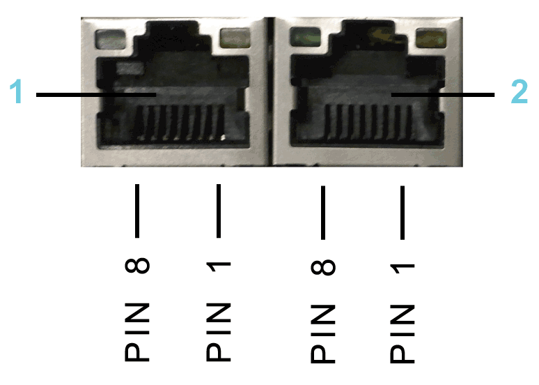
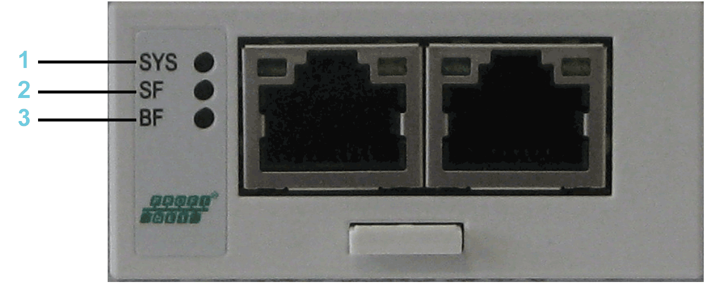
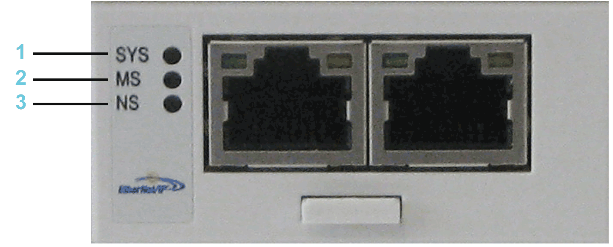
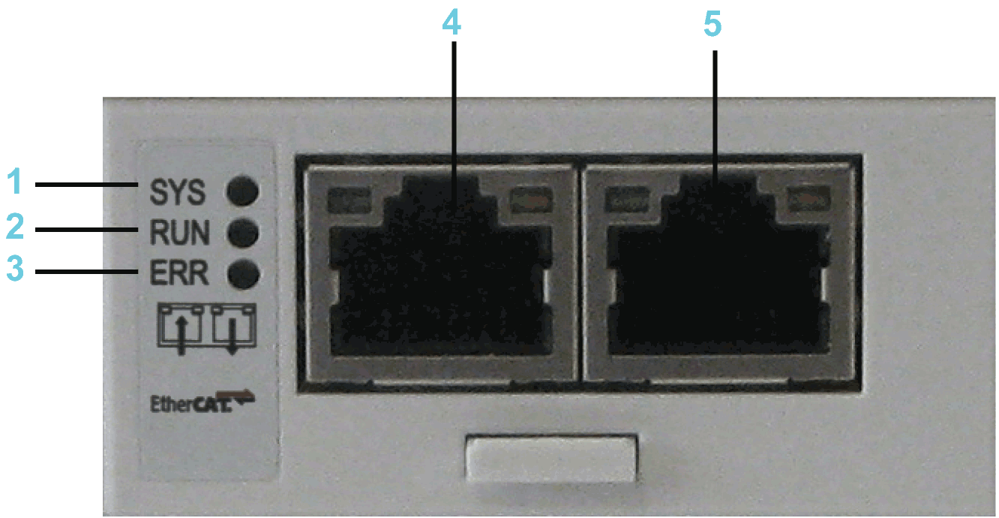

# Electrical Connections

## Connection Details Communication Module Realtime Ethernet

NOTE: The Realtime Ethernet communication module can be programmed differently. Depending on the protocol selected, you need to affix a label to the LEDs. Refer to [LED Labels of the Realtime Ethernet Communication Module](D-SE-0049409.html#D-SE-0049409__D-SE-0049409.3).

Connection details Realtime Ethernet

**1** Ethernet channel 0

**2** Ethernet channel 1

Ethernet outlet

| Pin | Designation | Meaning |
| --- | --- | --- |
| 1 | Tx+ | Transmit data + |
| 2 | Tx- | Transmit data - |
| 3 | Rx+ | Receive data + |
| 4 | TERM | – |
| 5 | TERM |
| 6 | Rx- | Receive data - |
| 7 | TERM | – |
| 8 | TERM | – |

## LED Description PROFINET

LEDs PROFINET

**1** **SYS** = System LED

**2** **SF** = System error

**3** **BF**= Bus error

System LED

| LED | Color | State | Meaning |
| --- | --- | --- | --- |
| **SYS** | **Duo LED yellow/green** | | |
| Yellow | Static | Bootloader netX (= roomloader) is waiting for second stage bootloader. |
| Green/yellow | Flashing green/yellow | Second stage bootloader is waiting for firmware. |
| Green | On | Operating system running. |
| Off | Off | No power supply. |

LEDs PROFINET IO RT controller

| LED | Color | State | Meaning |
| --- | --- | --- | --- |
| **SF** | **Duo LED red/green** | | |
| Red | On | (Together with **BF** red = on:)  No valid master license. |
| Red | Flashing cyclic at 2 Hz | System error detected: Invalid configuration. |
| Off | Off | Normal operation. |
| **BF** | **Duo LED red/green** | | |
| Red | On | No connection: No Link.  Or (together with **SF** red = on)  No valid master license. |
| Red | Flashing cyclic at 2 Hz | Configuration error detected: not all configured I/O devices are connected. |
| Off | Off | Normal operation. |
| **LINK**/RJ45 Ch0 & Ch1 | **LED green** | | |
| Green | On | A connection to Ethernet exists. |
| Off | Off | The device has no connection to Ethernet. |
| **RX/TX**/RJ45 Ch0 & Ch1 | **LED yellow** | | |
| Yellow | Flashes | The device sends/receives Ethernet frames. |

LEDs PROFINET IO RT device

| LED | Color | State | Meaning |
| --- | --- | --- | --- |
| **SF** | **Duo LED red/green** | | |
| Red | On | Watchdog timeout, channel, generic or extended diagnostic present; system error detected. |
| Red | Flashing cyclic at 2 Hz (for 3 s) | DCP signal service is initiated via the bus. |
| Off | Off | Normal operation. |
| **BF** | **Duo LED red/green** | | |
| Red | On | No configuration; or low speed physical link; or no physical link. |
| Red | Flashing cyclic at 2 Hz | No data exchange. |
| Off | Off | Normal operation. |
| **LINK**/RJ45 Ch0 & Ch1 | **LED green** | | |
| Green | On | A connection to Ethernet exists. |
| Off | Off | The device has no connection to Ethernet. |
| **RX/TX**/RJ45 Ch0 & Ch1 | **LED yellow** | | |
| Yellow | Flashes | The device sends/receives Ethernet frames. |

## LED Description EtherNet/IP

LEDs EtherNet/IP

**1** **SYS**= System LED

**2** **MS**= Module Status

**3** **NS**= Network Status

System LED

| LED | Color | State | Meaning |
| --- | --- | --- | --- |
| **SYS** | **Duo LED yellow/green** | | |
| Yellow | Static | Bootloader netX (= roomloader) is waiting for second stage bootloader. |
| Green/yellow | Flashing green/yellow | Second stage bootloader is waiting for firmware. |
| Green | On | Operating system running. |
| Off | Off | No power supply. |

LEDs EtherNet/IP Scanner (master)

| LED | Color | State | Meaning |
| --- | --- | --- | --- |
| **MS** | **Duo LED red/green** | | |
| Green | On | **Device operational**: If the device is operating correctly, the module status indicator is steady green. |
| Green | Flashes | **Standby**: If the device has not been configured, the module status indicator is flashing green. |
| Red | On | **Major error detected**: If the device has detected a non-recoverable error, the module status indicator is steady red. |
| Red | Flashes | **Minor error detected**: If the device has detected a recoverable error, the module status indicator is flashing red.  NOTE: An incorrect or inconsistent configuration is a minor error. |
| Red/green | Flashes | **Self-test**: While the device is performing its power-up testing, the module status indicator is flashing green/red. |
| Off | Off | **No power**: If no power is supplied to the device, the module status indicator is steady off. |
| **NS** | **Duo LED red/green** | | |
| Green | On | **Connected**: If the device has at least one established connection (even to the Message Router), the network status indicator is steady green. |
| Green | Flashes | **No connections**: The device has no established connections, but has obtained an IP address. In this case, the network status indicator flashes green. |
| Red | On | **Duplicate IP**: If the device has detected that its IP address is already in use, the network status indicator is steady red. |
| Red | Flashes | **Connection timeout**: If one or more connections in which this device is the target has timed out, the network status indicator is flashing red. This is left only if all timed out connections are re-established or if the device is reset. |
| Red/green | Flashes | **Self-test**: While the device is performing its power-up testing, the network status indicator is flashing green/red. |
| Off | Off | **Not powered, no IP address**: If the device does not have an IP address (or is powered off), the network status indicator is off. |
| **LINK**/RJ45 Ch0 & Ch1 | **LED green** | | |
| Green | On | A connection to Ethernet exists. |
| Off | Off | The device has no connection to Ethernet. |
| **ACT**/RJ45 Ch0 & Ch1 | **LED yellow** | | |
| Yellow | Flashes | The device sends/receives Ethernet frames. |

LEDs EtherNet/IP Adapter (slave)

| LED | Color | State | Meaning |
| --- | --- | --- | --- |
| **MS** | **Duo LED red/green** | | |
| Green | On | **Device operational:** If the device is operating correctly, the module status indicator is steady green. |
| Green | Flashes | **Standby**: If the device has not been configured, the module status indicator is flashing green. |
| Red | On | **Major error detected**: If the device has detected a non-recoverable error, the module status indicator is steady red. |
| Red | Flashes | **Minor error detected**: If the device has detected a recoverable error, the module status indicator is flashing red.  NOTE: An incorrect or inconsistent configuration is a minor error. |
| Red/green | Flashes | **Self-test**: While the device is performing its power-up testing, the module status indicator is flashing green/red. |
| Off | Off | **No power**: If no power is supplied to the device, the module status indicator is off. |
| **NS** | **Duo LED red/green** | | |
| Green | On | **Connected**: If the device has at least one established connection (even to the Message Router), the network status indicator is steady green. |
| Green | Flashes | **No connections**: If the device has no established connections, but has obtained an IP address, the network status indicator is flashing green. |
| Red | On | **Duplicate IP**: If the device has detected that its IP address is already in use, the network status indicator is steady red. |
| Red | Flashes | **Connection timeout**: If one or more connections in which this device is the target has timed out, the network status indicator is flashing red. This is left only if all timed out connections are re-established or if the device is reset. |
| Red/green | Flashes | **Self-test**: While the device is performing its power-up testing, the network status indicator is flashing green/red. |
| Off | Off | **Not powered, no IP address**: If the device does not have an IP address (or is powered off), the network status indicator is off. |
| **LINK**/RJ45 Ch0 & Ch1 | **LED green** | | |
| Green | On | A connection to Ethernet exists. |
| Off | Off | The device has no connection to Ethernet. |
| **ACT**/RJ45 Ch0 & Ch1 | **LED yellow** | | |
| Yellow | Flashes | The device sends/receives Ethernet frames. |

## LED Description EtherCat

LEDs EtherCAT

**1** **SYS**= System LED

**2** **RUN**= Run

**3** **ERR**= Error

**4** **Ethernet channel 0 - input port\***

**5** **Ethernet channel 0 - output port\***

**\*** Input port and output port are predetermined by firmware and are not configurable.

System LED

| LED | Color | State | Meaning |
| --- | --- | --- | --- |
| **SYS** | **Duo LED yellow/green** | | |
| Yellow | Static | Bootloader netX (= roomloader) is waiting for second stage bootloader. |
| Green/yellow | Flashing green/yellow | Second stage bootloader is waiting for firmware. |
| Green | On | Operating system running. |
| Off | Off | Power supply of the device is missing. |

LEDs EtherCAT-Slave

| LED | Color | State | Meaning |
| --- | --- | --- | --- |
| **RUN** | **Duo LED red/green** | | |
| Green | On | Operational: The device is in the OPERATIONAL state. |
| Green | Flashing cyclic with 2.5 Hz(1) | Pre-operational: The device is in the PRE\_OPERATIONAL state as defined for EtherCAT. |
| Green | Single flash(2) | Safe-operational: The device is in the SAFE-OPERATIONAL state as defined for EtherCAT. |
| Off | Off | Init: The device is in the initialization state. |
| **ERR** | **Duo LED red/green** | | |
| Red | Flashing cyclic with 2.5 Hz(1) | **Invalid configuration**: General configuration error detected.  Possible cause:  A status change specified by the master is not possible due to register- or object settings. |
| Red | Single flash(2) | **Local error:** The slave device application changed the EtherCAT status itself.  Possible cause 1:  A host watchdog timeout occurred.  Possible cause 2:  Synchronization error, the device automatically switches to SAFE-OPERATIONAL as defined for EtherCAT. |
| Red | Double flash(3) | **Process data watchdog timeout**: A process data watchdog timeout occurred.  Possible cause:  Sync-Manager watchdog timeout. |
| Off | Off | **No error**: The EtherCAT communication of the device is in operation. |
| **LINK**/RJ45 Ch0 & Ch1 | **LED green** | | |
| Green | On | A connection to Ethernet exists. |
| Green | Flashing cyclic with 2.5 Hz(1) | The device sends/receives Ethernet frames. |
| Off | Off | The device has no connection to Ethernet. |
| RJ45 Ch0 & Ch1 | **LED yellow** | | |
| – | – | This LED is not used. |
| (1) The LED is switched On (for 200 ms) and Off (for 200 ms) with a frequency of 2.5 Hz.  (2) The LED shows a short flash (200 ms) followed by a long Off phase (1000 ms).  (3) The LED shows a sequence of two short flashes (each 200 ms), interrupted by a short Off phase (200 ms). The sequence is completed with a long Off phase (1000 ms). | | | |
|  |
|  |

LEDs EtherCAT-Master

| LED | Color | State | Meaning |
| --- | --- | --- | --- |
| **RUN** | **Duo LED red/green** | | |
| Green | On | Operational: The device is in the OPERATIONAL state. |
| Green | Flashing cyclic with 2.5 Hz(1) | Pre-operational: The device is in the PRE\_OPERATIONAL state as defined for EtherCAT. |
| Green | Flickering (10 Hz)(2) | The device is not configured. |
| Green | Single flash(3) | Safe-operational: The device is in the SAFE-OPERATIONAL state as defined for EtherCAT. |
| Off | Off | Init: The device is in the initialization state. |
| **ERR** | **Duo LED red/green** | | |
| Red | Flashing cyclic with 2.5 Hz(1) | Invalid configuration. General configuration error detected. |
| Red | Single flash(3) | Bus Sync threshold error detected. |
| Red | Double flash(4) | Internal stop of the bus cycle |
| Red | Triple flash(5) | DPM watchdog has expired. |
| Red | Quadruple flash(6) | No master license present in the device. |
| Red | Single flickering(7) | Channel Init was expected at the master.  Transient state that may not be visible. |
| Red | Double flickering(8) | Slave is missing.  Unconfigured slave  No matching mandatory slave list.  No bus connected. |
| Red | Flickering (10 Hz)(2) | Boot-up was stopped due to detected errors. |
| Off | Off | **No errors detected**: The EtherCAT communication of the device is in operation. |
| **LINK**  Ch0 | **LED Green** | | |
| Green | On | A connection to Ethernet exists. |
| Green | Flickering (load dependent)(9) | The device sends/receives Ethernet frames. |
| Green | Off | The device has no connection to the Ethernet. |
| **ACT**  Ch0 | **LED Yellow** | | |
| Off | Off | The LED is not used. |

|  |  |  |
| --- | --- | --- |
| (1) The LED is switched On (for 200 ms), followed by Off (for 200 ms) with a frequency of 2.5 Hz.  (2) The LED is switched On (for 50 ms) and Off (for 50 ms) with a frequency of 10 Hz.  (3) The LED shows one short flash (200 ms) followed by a long Off phase (1,000 ms).  (4) The LED shows a sequence of two short flashes (each 200 ms), interrupted by a short Off phase (200 ms). The sequence is completed with a long Off phase (1000 ms).  (5) The LED shows a sequence of three short flashes (each 200 ms), interrupted by a short Off phase (200 ms). The sequence is completed with a long Off phase (1,000 ms).  (6) The LED shows a sequence of four flashes (each 200 ms), interrupted by a short Off phase (200 ms). The sequence is completed with a long Off phase (1,000 ms).  (7) The LED is switched On for 50 ms, followed by Off for 500 ms.  (8) The LED is switched On / Off / On for 50 ms, followed by Off for 500 ms.  (9) The LED turns On (for 50 ms) followed by Off (for 50 ms) with a frequency of approximately 10 Hz to indicate high Ethernet activity. The LED turns On and Off in irregular intervals to indicate low Ethernet activity. | | |
|  |
|  |
|  |
|  |
|  |
|  |
|  |
|  |

## LED Description C2C Slave

|  |  |  |  |
| --- | --- | --- | --- |
| LED | Color | State | Meaning |
| **LINK**/RJ45 Ch0 & Ch1 | **LED green** | | |
| Green | On | A connection to Ethernet exists. |
| Green | Flashing cyclic | The device sends/receives Ethernet frames. |
| Off | Off | The device has no connection to Ethernet. |
| RJ45 Ch0 & Ch1 | **LED yellow** | | |
| – | – | This LED is not used. |

## LED Description Additional Ethernet

|  |  |  |  |
| --- | --- | --- | --- |
| LED | Color | State | Meaning |
| **LINK**/RJ45 Ch0 & Ch1 | **LED green** | | |
| Green | On | A connection to Ethernet exists. |
| Off | Off | The device has no connection to Ethernet. |
| RX/TX/RJ45 Ch0 & Ch1 | **LED yellow** | | |
| yellow | Flashes | The device send/receives Ethernet frames. |

EIO0000001501.10