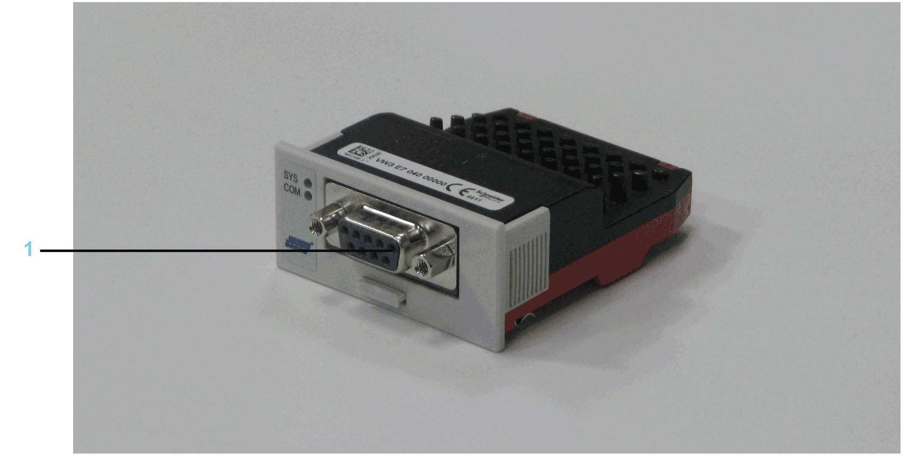

# Overview

## General Information

The communication module PROFIBUS DP provides a PROFIBUS interface.

Communication module PROFIBUS DP - connection

**1** PROFIBUS DP connection

After installing the optional module, the controller will automatically detect the module. Then configure it by using the PLC configuration in EcoStruxure Machine Expert Logic Builder.

EIO0000001501.10