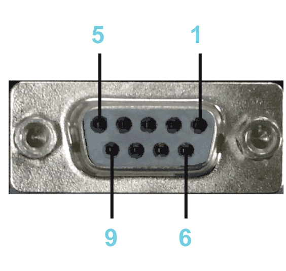
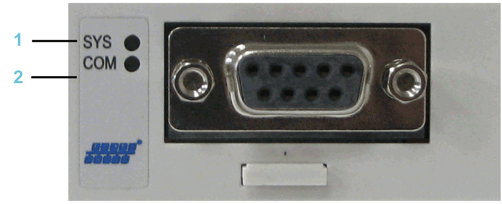

# Electrical Connections

## Connection Details Communication Module PROFIBUS DP

Connection details PROFIBUS DP

Connection assignment PROFIBUS DP

| Pin | Designation | Meaning |
| --- | --- | --- |
| 1 | – | Reserved |
| 2 | – | Reserved |
| 3 | Rx/Tx+(PB-B) | PROFIBUS DP - data line B (positive) |
| 4 | RTS | Return to send line for line control |
| 5 | PB-GND | Ground for PROFIBUS DP |
| 6 | PB-5V | 5 V power line for PROFIBUS DP |
| 7 | – | Reserved |
| 8 | Rx/Tx-(PB-A) | PROFIBUS DP - data line A (negative) |
| 9 | – | Reserved |

## LED Description PROFIBUS DP

LEDs PROFIBUS DP

**1** **SYS** = System LED

**2** **COM** = Communication

System LED

| LED | Color | State | Meaning |
| --- | --- | --- | --- |
| **SYS** | **Duo LED yellow/green** | | |
| Yellow | Static | Bootloader netX (= roomloader) is waiting for second stage bootloader. |
| Green/yellow | Flashing green/yellow | Second stage bootloader is waiting for firmware. |
| Green | On | Operating system running. |
| Off | Off | No power supply. |

PROFIBUS DP master - communication LED

| LED | Color | State | Meaning |
| --- | --- | --- | --- |
| **COM** | **Duo LED red/green** | | |
| Green | Flashing acyclic | No configuration or stack error detected. |
| Green | Flashing cyclic | PROFIBUS is configured, but bus communication is not yet released from the application. |
| Green | On | Communication to all slaves is established. |
| Red | Flashing cyclic | Communication to at least one slave is disconnected. |
| Red | On | Communication to one/all slaves is disconnected. |

PROFIBUS DP slave - communication LED

| LED | Color | State | Meaning |
| --- | --- | --- | --- |
| **COM** | **Duo LED red/green** | | |
| Green | On | RUN, cyclic communication. |
| Red | Flashing cyclic | STOP, no communication, connection error detected. |
| Red | Flashing acyclic | Not configured. |

EIO0000001501.10