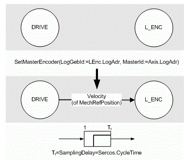
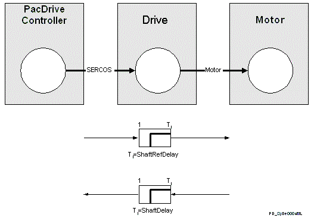

# General

## What Are Dead Times?

Dead times are delay times. They are caused by filters in the sensors (SensorDelay), by system processes (calculation), by transfer of values over bus systems (Sercos cycle or baud rate), by consecutively running processing of values (such as continued processing of calculated values (run times)).

## Where Do Dead Times Occur in The Velocity and Position Processing in The PacDrive System?

**Position Transmission Axis -> Logical encoder**

Due to the processing sequence in the PacDrive system, a dead time of one Sercos cycle occurs when transmitting the position (FC\_SetMasterEncoder() function) from an axis to a logical encoder.

Assignment and Sample Delay “Drive -> Logical sender”

The PacDrive system automatically takes this dead time into account (ShaftRefDelay).

**Mechanical motor shaft**

The transfer of the reference position from the PacDrive controller via the Sercos bus to the drive and the internal processing in the drive cause dead time.

This dead time is displayed by the PacDrive system in the axis parameter ShaftRefDelay.

A dead time also occurs when transferring the actual position from the motor via the drive and the Sercos bus to the PacDrive controller.

This dead time is displayed by the PacDrive system ShaftDelay of the axis.

Dead times (ShaftRefDelay and ShaftDelay) “Drive -> Motorshaft”

**Sensors**

Sensors are used to recognize markers in the PacDrive system. A position is assigned to a marker using the TouchProbe function. This can be used to create a control for print markers, for example.

Sensors have a dead time due to the type of marker recognition (inductive, for example) and the filtering of the signals being received. The PacDrive system accounts for this dead time in the SensorDelay parameter of the measure input.

**Cam switch group**

The cam switch group in the PacDrive system can be compensated for delay times while switching on and off using the OnDelay and OffDelay parameters.

## What Are The Goals of Dead Time Compensation?

Many Servo applications demand a high level of dynamics and position precision. Usually two functionalities play a decisive role:

* Synchronous run of several axes, or constantly running one motor with another based on a logical encoder, a real axis, or an external position encoder.
* Calculation of a position value at the same time as a mechanical event, such as for print marker correction or controlling product transfers. A digital sensor wired to a touch probe input detects the mechanical event.

To achieve synchronicity and position precision, system-specific dead times must be taken into account.

See also:

* Drive parameters determined by or derived from positions

EIO0000002335.11