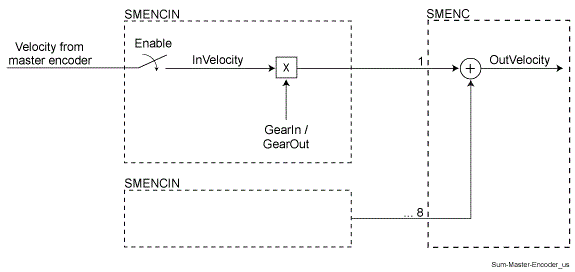
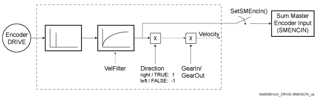
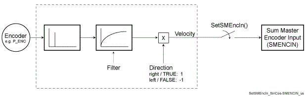

# Sum Master Encoder

## Task

To add speed signal in the PacDrive System, the Sum Master Encoder was integrated in the system.

Tasks of the Sum Master Encoder:

* Registration Correction

  The position deviation of the print mark is compensated by feeding a correction curve via the Sum Master Encoder.
* Overlapping a corrective curve to the actual curve (phase shift)

  When, for example, compensating a changing pressure angle of the belt drive, a constant production velocity can be achieved by feeding a corrective curve via the Sum Master Encoder.

## Functional Description

Functional principle of the Sum Master Encoder:

The speed signal of the master encoder is fed to the Sum Master Encoder. The allocation to the master is carried out with the *SetSMEncIn()* function.

Possible Master encoder:

* **Drive**
* Physical Master encoder (SinCos)
* Incremental Encoder Input
* Virtual encoder
* Sum Master Encoder

Connection “DRIVE” - “Sum Master Encoder”:

Connection “Master encoder” (P\_ENC,INC\_IN) - “Sum Master Encoder:

EIO0000002335.11