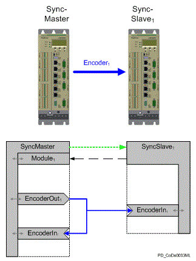
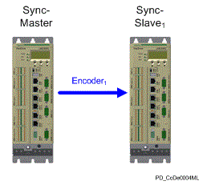
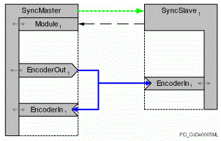
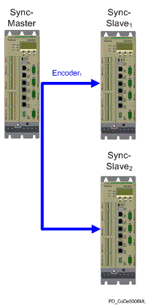
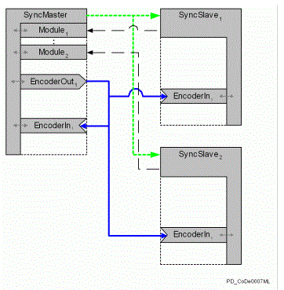

# Encoder Network

## General

There are a number of cased that require several machines to be coupled using velocity alignment or even angular alignment. One example is when a product is moved from a blister packer to a cartoner. This requires a transfer of precise velocity information and position information from one machine to another.

Bus terminal BT-4/ENC1 is available for the controllers. The BT-4/ENC1 has an Incremental Encoder Output. The output signal is coupled electrically in the upstream machine via an encoder input.

This makes a flexible angle-synchronous coupling available. Generally, further measures are required for one-off balancing of the position between both machines as well as a continual exchange of status and error information.

An alternative solution is the encoder network. Based on the PacDrive controllers Ethernet connection, you can use Ethernet to distribute “encoder data” to distributed controllers to synchronize machines.

## Features

General requirements for the encoder network

* Easy to configure and start
* Simple, flexible application integration
* Simple, robust wiring
* Low cost

Specific requirements for the encoder network

* Cross-machine virtual vertical shafts
* Integrated monitoring and status functions
* Coordinated reactions to perform diagnostics
* Additional transmissions of user data

## Design - Encoder Network

An encoder network consists of two or more PacDrive controllers. Precisely one controller must take over the function Synchronization master. The other participants operate as Synchronization slave. The Synchronization master takes over the synchronization and coordination of the encoder network. The network cannot function without it.

The tasks of the encoder network presented here can be broken down into five subtasks:

* Synchronizing the local clocks on the participating controllers and providing a global clock (in ms) for the entire system
* Distributing encoder data
* Managing network data
* Distributing additional user data
* Providing a coordinated diagnostic of the participating controllers

Default architecture and dataflow in an encoder network:

The diagram shows the simplest architecture for an encoder network: a master and a slave connected to each other by Ethernet. The Sync. encoderoutput of the Synchronization master (EncoderOutput) supplies the encoder data to the Sync. encoder input (EncoderIn) of the Synchronization slave. At the same time, the date is returned to the local Sync. encoder input of the Synchronization master. Looking at the dataflow, you can divide the communication into two levels: a bi-directional communication level between the Synchronization master and Synchronization slave and a uni-directional communication from Sync. encoder outputt to the Sync. encoder inputs. The following data gets exchanged in the process:

Transferring from Synchronization master to Synchronization slave (“green arrow”):

* The global clock of the master
* Information for checks and diagnostic
* User data with time stamp

Reply of the Synchronization slave to Synchronization master (“black arrow”):

* Information about status and diagnostic
* Quality of synchronization
* User data with time stamp

Transmission of unidirectional encoder data:

* Encoder position
* User data (same as encoder position)

## Synchronization

Clock synchronization takes place according to the master-slave principle. The Synchronization master distributes a synchronized time to its [Sercos](D-SE-0073356.html#D-SE-0073356) cycle in a µs resolution. Synchronization slaves synchronize their clocks and, therefore their Sercos loop according to this global timing error for synchronizing the clocks is low at 200 µs.

## Encoder Data

The main task of the encoder network is to implement an encoder that is available to the whole network. In doing so, the source of the encoder data is limited to the Synchronization master.

Because telegrams can be delayed anytime when communication is effected via standard Ethernet, the encoder data carry a time stamp that is shifted in time by a specified value (DataDelay parameter). The recipient writes encoder data to a buffer and then reads it out when the time stamp matches the global time. The length of the delay depends on how high the network load is.

## Management

The Synchronization master is responsible for managing an encoder network. It first needs to set up cyclical communication. For this purpose, the Synchronization slave is addressed and configured individually by the Synchronization master. The Synchronization slave is assigned to a multicast group for this purpose. Furthermore, the configuration of the Synchronization slave is checked (for example, Sercos cycle time).

Once the configuration has been completed, the Synchronization master cyclically sends a multicast telegram that is received by the Synchronization slave (Other network participants that do not belong to this multicast group already reject the telegram at the hardware level).

As soon as the Synchronization slave receives the cyclic telegrams from the Synchronization master, the Synchronization slave begins to send back reply telegrams (Unicast) to the Synchronization master within in their set cycle time.

The status information in this telegram provides the Synchronization master, among others, information:

* Whether the slaves are synchronized
* Whether encoder data is being received
* Whether an error occurred on the slave

The Synchronization master evaluated this status information and sends the respective control information in its cyclic telegram for controlling the Synchronization master.

## User Data

You can send user data in an encoder network for any of the communication connections shown in the figure.

User data can be up to 16 bytes and can be one of the following varieties:

* Asynchronous transferring from the Synchronization master to the Synchronization slave (MasterUserData, “green arrow”).
* Asynchronous transferring from the Synchronization slave to the Synchronization master (SlaveUserData, “black arrow”).
* Asynchronous transferring from Sync. encoder output to the Sync. encoder input (UserData, “blue arrow”).

During asynchronous transferring, data is sent cyclically (MasterCycleTime or SlaveCycleTime) with the current global time stamp. No checks take place to confirm whether the data arrived. Data (including the global send time stamp) is displayed as soon as it is received. For a synchronous transmission, data is transferred at the same time as encoder data. It is cached upon receipt just like the encoder data and both are displayed simultaneously. If a telegram is invalid a message is issued about the diagnostic. In addition, the DataValid parameter can be used to check whether valid data is available for the current cycle.

## Diagnostic

The diagnostic of the encoder network is dived between the two communication levels.

* Synchronization of local clocks
* Exchange of encoder data

You can set how exact the communication connection shall be individually, depending on the application. If errors occur to the page of the Synchronization slave, these are displayed in the status word (as far as possible) and the master prompts a corresponding reaction.

You generally specify how many cycles go by before an unrecoverable error is reported for monitoring. The complete encoder network is stopped by the Synchronization master when an unrecoverable error occurs in the encoder network.

If an unrecoverable error occurs while encoder data is being exchanged (8333 "Receiving EncoderNet data not possible"), the encoder network remains in sync and the synchronization encoders must resume distributing encoder data after the error has been acknowledged.

However, if an unrecoverable synchronization error occurs (8335 "EncoderNet Sync. not possible"), you must set up (configure and synchronize) the encoder network again.

Before an unrecoverable error gets triggered, you see a single error as a message. The encoder network remains active during these advisories. A message is issued for a synchronization error when half the set cycles have been reached and no new telegram has been received (8336 "EncoderNet Sync. disturbance detected").

A message is issued when encoder data is being exchanged even if only one single telegram has not been received (8334 "Receiving EncoderNet data disturbance detected").

## System Requirements

Hardware

* PacDrive controller
* Full duplex, 100 MBit Ethernet connection using a (managed) switch

## Architectures

The following introduces a few examples of possible architectures. Each of the examples contains two figures. The first figure shows controllers and “encoder connections”. The second figure represents the configuration as a block diagram with more details.

Simple encoder connection between two controllers:

Block diagram of a simple encoder connection between two controllers:

The simplest configuration consists of two controllers with an encoder connection between the two slaves. Synchronization master transmits output signal EncoderOut1 to controller "Synchronization slave" as a signal for input EncoderIn1. At the same time, EncoderOut1 is returned to input EncoderIn1 on Synchronization master. This allows both devices to access the same synchronized encoder data. Synchronization master coordinates and executes the configuration, clock synchronization, and checks in the encoder network.

One possible case of operation for this configuration would be a production machine (such as blister packer) connected to a packaging machine (such as a cartoner).

Encoder connection between more than two controllers with one encoder data source:

Block diagram of an encoder connection between more than two controllers with one encoder data source:

The example shows three controllers. The signal EncoderOut1 from Synchronization master is distributed to controllers SyncSlave1 and SyncSlave2 and gets returned simultaneously to Synchronization master. This allows the three devices to access the same synchronized encoder data. This method allows for two cases of application.

In the first variation, you can use output EncoderOut1 as a virtual vertical shaft for the three machines (such as supply machine, production machine, packaging machine). The second possibility is to operate two machines as upstream machine of the master (for example, production machine with two packing machines). In this case, it may actually be redundant to return the encoder signal from EncoderOut1 back to EncoderIn1 on Synchronization master.

## Restrictions

**Delays resulting from the Ethernet interface**

Because encoder data is transmitted using a standard Ethernet interface, individual telegrams could be delayed by several milliseconds or even destroyed during transmission. However, you can influence these factors by using an appropriate Ethernet infrastructure.

When doing so, you must implement the following points:

* Connection of the controllers involved to a 100 Mbit/s full-duplex switch.
* You must use shielded Ethernet cables that are suitable for the surroundings (at least CAT5).
* You must minimize network load resulting from communication not related to synchronization (especially broadcasts).

Beyond that, the following measures can also help with synchronization:

* Use a managed switch that uses VLAN and prioritized telegrams, since synchronization telegrams are set to highest priority.
* Isolate the network (so it has no direct connection to the rest of the company network).

To compensate these communication influences and delays, a delay has been installed for the use of the encoder data that can be determined using the parameter DataDelay of the Sync. Encoder output.

**Specifications for the cycle times**

To avoid a complicated interpolation of encoder data, it is a requirement that you have set the same [Sercos cycle time](D-SE-0073362.html#D-SE-0073362) for the participating controllers. This is a necessity as the cycle time for the synchronization and encoder data exchange have been set fixed to the Sercos cycle time.

## Example: “Distributed Vertical Shaft”

The following example presents a machine configuration where a virtual vertical shaft is distributed to the slave controllers. For simplification, only two controllers (one Synchronization master and one Synchronization slave) are used, but several Synchronization slave can be used in the same way.

For this purpose, a virtual master encoder is used for the Synchronization master that illustrates a virtual Line Shaft. When you initialize the system, you can call it using the following command: `SetMasterEncoder(_SyncDataOut ,_VMEnc);`

called. For the local Line Shaft, then the controllers Synchronization master and Synchronization slave) of the Sync. encoder input must be used.

Example:

`SetMasterEncoder(_LEnc, _SyncDataIn);`

To be able to implement this example, the following objects must be inserted in the Synchronization master controller:

* [Virtual master encoder](D-SE-0075678.html#D-SE-0075678)  (VMEnc)
* Synchronization master (SyncMaster)

  + Sync. Module (SyncModule\_1)
  + Sync. Encoder output (SyncDataOut)
  + Sync. Encoder Input (SyncDataIn)

The following objects are required for the Synchronization slave controller:

* `Synchronization slave` (Synchronization slave)

  + `Sync. Encoder Input` (SyncDataIn)

It is relatively easy to configure this example because almost the parameters use default values. The table shows the effects if default values.

Only the following two parameters must be set in the `Sync. Module` (SyncModule\_1):

* SyncModule\_1.Enable = true
* SyncModule\_1.SlaveIPAdress = <IP-Address of the Synchronization slave controller>

If the example also has to operate with a `Sercos cycle time` of 4 ms, the parameter SyncModule\_1. SlaveCycleTime must be additionally changed to 8 ms or 12 ms as the synchronization slave cycle time has to be a multiple of the Sercos [CycleTime](D-SE-0073362.html#D-SE-0073362).

For starting the synchronization, you then only have to set the Enable parameter of the Synchronization slave and Synchronization master to true. As soon as the parameter State of the Synchronization slave and the Synchronization master changes to "5 / active", the synchronization has been set and the encoder network is ready for use.

Effects of cycle time parameters and limit parameters

| Parameters | Sercos cycle time / effect |
| --- | --- |
| SyncMaster.MasterCycleErrorLimit = 20 Cycles | 1 ms: Advisory 336 after 10 ms / Error 335 after 20 ms  2 ms: Advisory 336 after 20 ms / Error 335 after 40 ms  4 ms: Advisory 336 after 40 ms / Error 335 after 80 ms |
| SyncModule\_1.SlaveCycleTime= 10 ms (8 ms/ 12 ms for Sercos Cycle time = 4 ms | Status telegram of the Synchronization slave every  1 ms: 10 ms  2 ms: 10 ms  4 ms: (8/12 ms) |
| SyncModule\_1.SlaveCycleErrorLimit = 10 Cycles | 1 ms: Advisory 336 after 50 ms / Error 335 after 100 ms  2 ms: Advisory 335 after 50 ms / Error 335 after 100 ms  4 ms: Advisory 336 after (40 ms / 60 ms Error 335 after (80 ms / 120 ms) |
| SyncDataOut.DataDelay = 10 Cycles | Encoder data is used after  1 ms: 10 ms  2 ms: 20 ms  4 ms: 40 ms |
| SyncDataIn.DataCycleErrorLimit = 1 Cycle | 1 ms: Advisory 336 after 1 unsuccessful telegram or 11 ms telegram delay / Error 335 after 2 unsuccessful telegrams or 12 ms telegram delay  2 ms: Advisory 336 after 1 unsuccessful telegram or 22 ms telegram delay / Error 335 after 2 unsuccessful telegrams or 24 ms telegram delay  4 ms: Advisory 336 after 1 unsuccessful telegram or 44 ms telegram delay / error 335 after 2 unsuccessful telegrams or 48 ms telegram delay |

## Example: “Coupling to a Real Axis”

This example deals with two machines coupled via the encoder network. With the Synchronization slave controller being supposed to follow a real axis of the Synchronization master.

These are the goals:

* Fast error reporting
* Smallest possible buffer for telegrams

The requirements are the same here as they were in the first example. However, the [virtual master encoder](D-SE-0075678.html#D-SE-0075678) (VMEnc) can be omitted as it is replaced by a real axis. In this case, the connection between axis and sync. encoder output is established with the `SetMasterEncoder(_SyncDataOut,_Axis)`;command.

Moreover, the sync. Encoder input can be omitted at the Synchronization master as the encoder signal is no longer required by the Synchronization master.

Beyond that, you need to adjust several parameters to achieve your new goals:

As the status messages of the Synchronization slave only came relatively slowly in the first example, for a quick reaction in event of an error it is necessary to reduce the cycle time of the slave telegrams (SyncModule\_1.SlaveCycleTime = [Sercos CycleTime](D-SE-0073362.html#D-SE-0073362) (1, 2 ms or 4 ms)). For this reason, the error limit must be increased in order to compensate for occurring telegram delays (SyncModule\_1.SlaveCycleErrorLimit = 20 cycles).

The bi-directional communication between the Synchronization master and Synchronization slave is now carried out at the same velocity in both directions. However, care must be taken that the loading of the Ethernet communication increases due to this and that this may lead to fewer controllers of the Synchronization slave that can be used.

For achieving the primary goal, the smallest possible delay between the Synchronization master and Synchronization slave, the parameter SyncDataOut.DataDelay is reduced to one cycle. However, you must also balance out this short delay with a higher error tolerance. In order to achieve this, the Sync. encoder input on the Synchronization slave must be increased to 10 cycles for the parameter SyncDataIn.DataCycleErrorLimit.

As the `Sync. encoder inputs` already release the advisory for a telegram receiving error when one telegram is missing, it may be necessary to set the diagnostic reaction of the diagnostic message 334 "Error receiving encoder data (warning)" to the diagnostic class 8 and therefore only enter it in the message logger. You can do so using the following command: FC\_DiagConfigSet(334,8);

Effects of cycle time parameters and limit parameters

| Parameters | Sercos cycle time / effect |
| --- | --- |
| SyncMaster.MasterCycleErrorLimit = 20 Cycles | 1 ms: Advisory 336 after 10 ms / Error 335 after 20 ms  2 ms: Advisory 336 after 20 ms / Error 335 after 40 ms  4 ms: Advisory 336 after 40 ms / Error 335 after 80 ms |
| SyncModule\_1.SlaveCycleTime= 1 ms / 2 ms / 4 ms (for Sercos Cycle time = 1 ms / 2 ms / 4 ms) | Status telegram of the Synchronization slave every  1 ms: 1 ms  2 ms: 2 ms  4 ms: 4 ms |
| SyncModule\_1.SlaveCycleErrorLimit = 20 Cycles | 1 ms: Advisory 336 after 10 ms / Error 335 after 20 ms  2 ms: Advisory 335 after 20 ms / Error 335 after 40 ms  4 ms: Advisory 336 after 40 ms / Error 335 after 80 ms |
| SyncDataOut.DataDelay = 1 Cycle | Encoder data is used after  1 ms: 1 ms  2 ms: 2 ms  4 ms: 4 ms |
| SyncDataIn.DataCycleErrorLimit = 10 Cycles | 1 ms: Advisory 336 after 6 unsuccessful telegrams or a telegram delay of 7 ms / Error 335 after 11 unsuccessful telegrams or a telegram delay of 12 ms  2 ms: Advisory 336 after 6 unsuccessful telegrams or a telegram delay of 14 ms/ Error 335 after 11 unsuccessful telegrams or a telegram delay of 24 ms  4 ms: Advisory 336 after 6 unsuccessful telegrams or a telegram delay of 28 ms / Error 335 after 11 unsuccessful telegrams or a telegram delay of 48 ms |

EIO0000002335.11