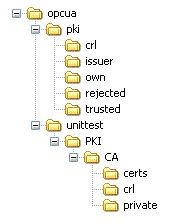

# Overview

## General

An OPC unified architecture server (OPC UA server), allowing communication with OPC UA clients for the data exchange, is integrated into the controller firmware.

This chapter provides an overview of the features and functions of the OPC UA server.

The OPC UA server supports data access (DA). The encryptions None, Basic256Sha256, Aes128\_Sha256\_RsaOaep, and Aes256\_Sha256\_RsaPss are available for the connection to the OPC UA clients. The authentications "Anonym" and "User name and password" are components of the OPC UA server.

The following data types are supported:

| IEC 61131-3 | OPC UA types |
| --- | --- |
| BIT | Boolean |
| BOOL | Boolean |
| USINT | Byte |
| BYTE | Byte |
| INT | Int16 |
| DINT | Int32 |
| LINT | Int64 |
| WORD | UInt16 |
| UINT | UInt32 |
| TIMEOFDAY | UInt32 |
| TIME | UInt32 |
| DWORD | UInt32 |
| UDINT | UInt32 |
| ENUM | UInt32 |
| LTIME | UInt64 |
| LWORD | UInt64 |
| ULINT | UInt64 |
| REAL | Float |
| LREAL | Double |
| STRING | String |
| SINT | SByte |
| DATEANDTIME | DateTime |
| DATE | DateTime |
| ARRAY | Object |
| USERDEF (FB) | Object |
| NONE (folder) | Object |
| REFERENCE | Pointer |

In addition to IEC base data types, the OPC UA server can also expose OPC UA variables from IEC symbols that are composed of the following complex types:

* Arrays and Multi-Dimensional Arrays. These are limited to 3 dimensions.
* Structured data types, and nested structured data types. As long as they are not composed of a UNION field.

## OPC UA Server Directory Structure

The directory opcua with the following structure was added to the memory card of the controller:

| Directory | Contents |
| --- | --- |
| ide0:\ESystem\opcua | The server configuration file ServerConfig.ini is located in this directory. |
| ide0:\ESystem\opcua\pki\own | The server certificate is located in this directory. |
| ide0:\ESystem\opcua\pki\rejected | The client certificates that the server does not trust are located in this directory. See also [Client certificate management](D-SE-0070729.html#D-SE-0070729__D-SE-0070729.13) and [Enabling security](D-SE-0070730.html#D-SE-0070730__D-SE-0070730.7). |
| ide0:\ESystem\opcua\pki\trusted | The client certificates that the server trusts are located in this directory. See also [Client certificate management](D-SE-0070729.html#D-SE-0070729__D-SE-0070729.13) and [Enabling security](D-SE-0070730.html#D-SE-0070730__D-SE-0070730.7). |

EIO0000002335.11