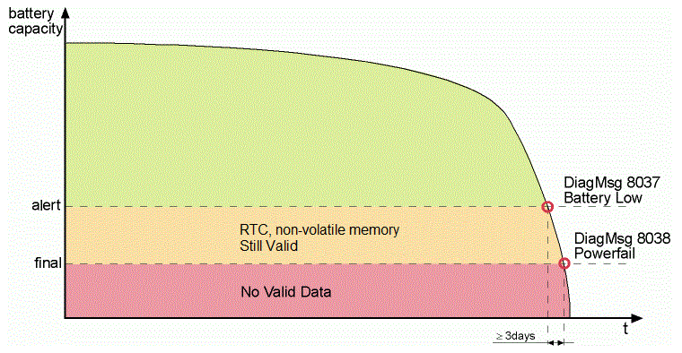

# BatteryLowWarningDelay

## General

|  |  |
| --- | --- |
| Type | EF |
| Devices supporting the parameter | PacDrive LMC x00C,  PacDrive LMC x01C |
| Traceable | Yes |

## Functional Description

The diagnostic message 8037 "Battery low" can be delayed.

You can set a delay time (in hours) for the diagnostic message 8037 "Battery low" in the parameter BatteryLowWarningDelay. If the capacity of the battery goes below a minimum value, the diagnostic message is triggered. If the diagnostic message is acknowledged without replacing the battery, the diagnostic message will be triggered after the defined delay time has elapsed. The delay of the diagnostic message 8037 "Battery low" is not continued when the system is reset.

The delay time for the diagnostic message 8037 "Battery low" is set in the parameter `BatteryLowWarningDelay.`

## Example

You want to be reminded that the battery must be replaced 6 h and 30 min after diagnostic message 8037 was acknowledged. -> Set the value of the `BatteryLowWarningDelay` parameter to 6.5.

## Technical Background

The battery buffers the supply voltage of the non-volatile memory (memory of the message logger and the retain data) and the real-time clock when the controller is turned off. If the battery cannot deliver supply voltage to the non-volatile memory because of insufficient capacity, the data cannot be permanently saved in the non-volatile memory and the real-time clock stops running.

The battery drains over time while the device is turned off. This means that the battery may not deliver enough voltage for buffering the data if the controller has been turned off for a long period. In this case, the battery must be replaced. The PacDrive system diagnostic informs the user of the state of the data in the non-volatile memory.

There are two diagnostic messages:

* 8037 "Battery low"
* 8038 "NvRam/RTC power fail detected"

If the capacity of the battery goes below a minimum value (refer to the alert limit in the figure), the diagnostic message 8037 "Battery low" is triggered. If possible, you should replace the battery while the system is running. When the controller is turned off, the battery saves the data in the non-volatile memory for at least three more days. The battery must be replaced during this period at the latest. Diagnostic message 8037 "Battery low" can be acknowledged.

NOTE: More details on replacing the battery can be found in the PacDrive controller manuals and guides. If the capacity of the battery is so low that the data cannot be buffered in the non-volatile memory, the message 8038 "NvRam/RTC power fail detected" is triggered. The battery must be replaced and the retain data must be reinitialized.

Behavior of the PacDrive system when the battery capacity is insufficient:

EIO0000002335.11