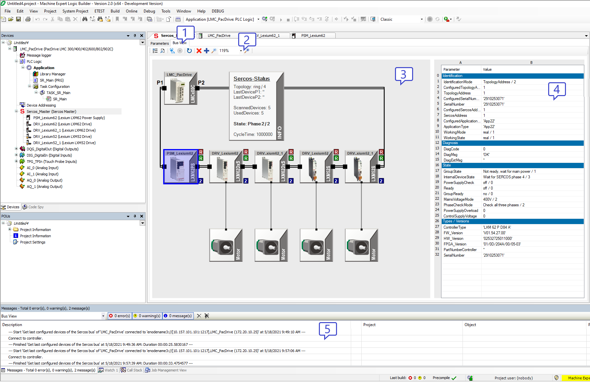
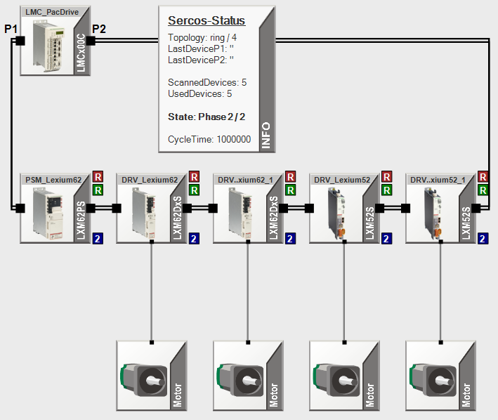
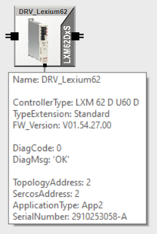

# User Interface

## Overview

To display Bus View, double-click the Sercos Master in the Devices tree. Then click the Bus View tab in the Sercos editor. Bus View provides the following user interface:

| 1 | Bus View tab |
| 2 | Toolbar  The [toolbar](#UserInterface-C099EC2C__Toolbar-C0FB794F) provides buttons for access to Bus View functions. |
| 3 | Topology View  If the function [Rescan Sercos devices](#UserInterface-C099EC2C__RescanSercosDevices-21C17ECF) is used, the [Topology View](#UserInterface-C099EC2C__TopologyView-C0FB7CF2) displays the devices in the controller configuration, and the devices resulting from the last bus scan with Sercos in communication phase 2 (that is, devices physically present on the Sercos bus, but not contained in the controller configuration, or vice versa, devices contained in the controller configuration, but not physically present on the Sercos bus).  If the function [Browse Sercos devices](#UserInterface-C099EC2C__BrowseSercosDevices-21C180C8) is used, the Topology View displays the devices found on the Sercos bus via the Sercos Internet Protocol (S/IP). |
| 4 | Parameters List  The [Parameters List](#UserInterface-C099EC2C__ParametersList-C0FB7F15) displays a number of the parameters and the values of the device selected in the Topology View.  The parameters displayed depend on whether the Sercos bus was rescanned ([Rescan Sercos devices](#UserInterface-C099EC2C__RescanSercosDevices-21C17ECF)) or browsed ([Browse Sercos devices](#UserInterface-C099EC2C__BrowseSercosDevices-21C180C8)) for Sercos devices. |
| 5 | Message View  The [Message View](#UserInterface-C099EC2C__MessageView-C0FB8059) displays status and diagnostics messages on activities performed with Bus View. |

## Toolbar

The toolbar provides the following buttons and controls:

|  |  |
| --- | --- |
|  | Click this button to display the devices in the controller configuration resulting from the last bus scan with Sercos in communication phase 2.  Since the devices displayed in the Topology View represent the configuration of the connected controller and on the Sercos bus, the devices may be different from the configuration in the open project. |
|  | This button provides access to two functions via the down arrow:  * Rescan Sercos devices * Browse Sercos devices  Rescan Sercos devices:  This function rescans the Sercos bus for Sercos devices. It sets Sercos to communication phase 0 and then to communication phase 2 to update the Topology View to the current configuration. After the scan, Sercos is set to communication phase 0.  Browse Sercos devices:  This function browses the Sercos bus using the Sercos Internet Protocol (S/IP) for Sercos devices supporting S/IP. The function is performed independently of the Sercos communication phase. The status bar displays the number of devices found while the function is running.  NOTE: Scanning displays the logical devices, browsing displays the physical devices. A Double Drive is displayed as two scanned devices, but as one browsed device.  Use the function Rescan Sercos devices to get detailed information on the Sercos parameters of the devices on your Sercos bus. Use the function Browse Sercos devices if Sercos is not able to phase up to at least Sercos communication phase 2. The function Browse Sercos devices also displays devices whose Sercos communication parameters have invalid values.  The default function performed by clicking the button itself is Rescan Sercos devices. |
|  | Click this button to perform a Sercos bus analysis. The Message View provides diagnostics information.  As opposed to a rescan of the Sercos devices, the Sercos communication phase is not set to 0 to allow for live indication of modifications to the Sercos bus configuration. |
|  | Click this button to set the Sercos bus to communication phase 0 after a Sercos bus analysis. The function is only available up to communication phase 2. |
|  | Click this button to refresh the online values if you are not logged in to the controller application. If you are logged in to the controller application, the values are refreshed automatically, and the button is displayed with a green background. |
|  | This button provides a filter function. Click this button to display Sercos devices that are contained in the controller configuration, but that are not physically present on the Sercos bus, or that could not be assigned. The corresponding devices are marked with a red “x” in the Topology View window.  NOTE: The function Browse Sercos devices does not allow for an assignment. This means that the devices contained in the controller configuration are marked with a red "x" if you use this function.  If the filter is active, the button is displayed with a blue frame. |
|  | This button provides a filter function. Click this button to display Sercos devices that are physically present on the Sercos bus, but that are not contained in the controller configuration, or that could not be assigned. The corresponding devices are marked with a blue “+” in the Topology View window.  NOTE: The function Browse Sercos devices does not allow for an assignment. This means that the devices physically present on the Sercos bus are marked with a blue "+" if you use this function.  If the filter is active, the button is displayed with a blue frame. |
|  | Click this button to zoom out in the Topology View window. |
|  | Use this control to select one of the zoom levels between 10 % and 500 %. The control also provides an option to fit all devices into the Topology View window. |
|  | Click this button to zoom in in the Topology View window. |

## Topology View

The Topology View is a graphical representation of the devices found on the Sercos bus. If you use the function [Rescan Sercos devices](#UserInterface-C099EC2C__RescanSercosDevices-21C17ECF), the Topology view displays the devices found in the controller configuration and on the Sercos bus. If you use the function [Browse Sercos devices](#UserInterface-C099EC2C__BrowseSercosDevices-21C180C8), the Topology View displays the devices found in the controller configuration and the devices found on the Sercos bus via S/IP. The following screenshots provide examples with the function Rescan Sercos devices.

Each Sercos device is represented by an icon. The Sercos status is displayed in an Info box using a variety of parameters. Certain devices which are connected to Sercos devices but which are not a part of the Sercos bus (such as motors) are also displayed.

If you use the function Rescan Sercos devices, scanned and assigned devices are sorted from left to right in ascending order by the value of the parameter TopologyAddress. If you use the function Browse Sercos devices, the devices are sorted from left to right in ascending order by the IP address. Devices displayed with a red “x” (refer to [Examples](Examples-C09D34CF.html#Examples-C09D34CF) for details) are sorted from left to right in ascending order by the value of the parameter ConfiguredTopologyAddress.

If an error has been detected, a corresponding message is provided in the Info box.

Hovering the mouse pointer over the icon of a device displays a tooltip with Sercos information:

The tooltip displays information on the device obtained during the Sercos bus scan. If it was possible to assign the device to a device in the project configuration in communication phase 2, additional information on the controller configuration is provided.

Clicking the icon of a device displays the [Parameters List](#UserInterface-C099EC2C__ParametersList-C0FB7F15) for the device.

Right-clicking the icon of a device provides access to the following functions:

* If an error has been detected, you can display the online help for details on the detected error.
* You can open the device editor for the corresponding device.

  Bus View identifies the device editor to open by the name of the device. If the configuration of the opened project is not the same as the configuration of the controller to which you are connected, the device editor may not be the one you want to open.
* You can activate and deactivate a device signal for the selected device that is displayed in the bottom right corner of the device icon. The corresponding LED of the device flashes or stops to flash.

## Parameters List

The Parameters List is displayed to the right of the Topology View. The contents of the Parameters List depends on the function used.

Function [Rescan Sercos devices](#UserInterface-C099EC2C__RescanSercosDevices-21C17ECF):

* The Parameters List contains a variety of parameters of the controller configuration for the selected device if this device could be assigned to a scanned device.
* If no controller configuration data is available, the Parameters List displays a corresponding message.

Function [Browse Sercos devices](#UserInterface-C099EC2C__BrowseSercosDevices-21C180C8):

* The Parameters List contains a variety of parameters obtained via S/IP.

If you use the function Rescan Sercos devices, the values are automatically refreshed if you are logged into the controller application (online). If you are not logged in, use the corresponding button on the [toolbar](#UserInterface-C099EC2C__Toolbar-C0FB794F) to refresh the parameter values.

## Message View

The Messages window features a category to display Bus View messages. The messages provide information on the progress and results of actions performed with Bus View. For example, if you run an analysis of the Sercos bus, the individual steps and results are documented, and troubleshooting possibilities are suggested.

For a variety of entries, a “…” button is displayed which either opens the appropriate device editor or takes you directly to the corresponding topic in the online help.

## Mouse Support

|  |  |
| --- | --- |
| Action | Result |
| Click | Selects the device below the mouse pointer. |
| Double–click | Opens the device editor of the device with the same device name in the current project.  Bus View identifies the device editor to open by the name of the device. If the configuration of the opened project is not the same as the configuration of the controller to which you are connected, the device editor may not be the one you want to open. |
| Mouse wheel | Moves the content of the Topology View window:   * Vertical movement if only the vertical scrollbar is visible * Horizontal movement if only the horizontal scrollbar is visible |
| Mouse wheel + CTRL key | Zooms in and out of the Topology View window. |
| Mouse wheel + CTRL key + SHIFT key | Quick zoom in the Topology View window. |
| Drag (left mouse button held down) at position without selectable object below mouse pointer | Drags the content of the Topology View window. |
| Mouse wheel double click | Zooms to "Fit to screen". |

## Keyboard Shortcuts

|  |  |
| --- | --- |
| Key or key combination | Result |
| LEFT ARROW | Selects the previous device visible in the Topology View window, or the last device if no device is selected. |
| RIGHT ARROW | Selects the next device visible in the Topology View window, or the first device if no device is selected. |
| LEFT ARROW + SHIFT | Selects the previous device with a detected error visible in the Topology View window. |
| RIGHT ARROW + SHIFT | Selects the next device with a detected error visible in the Topology View window. |
| HOME (Pos1) | elects the first device visible in the Topology View window. |
| END | Selects the last visible device visible in the Topology View window, |

EIO0000002335.11