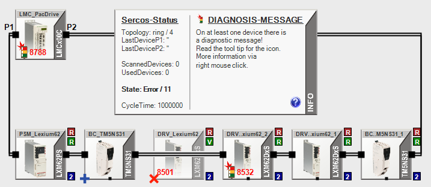
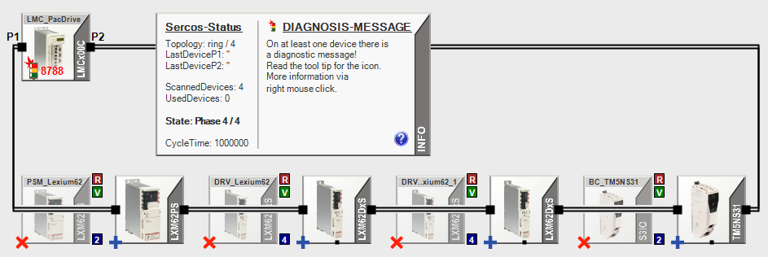
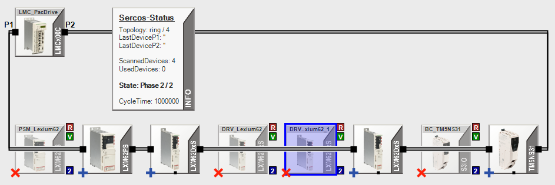
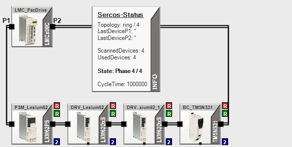
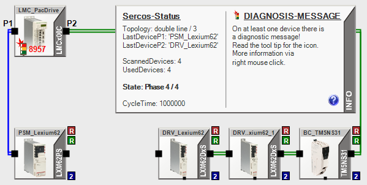

# Examples

## Analysis Results

The following screenshot presents analysis results. The information displayed was obtained with the function [Rescan Sercos devices](UserInterface-C099EC2C.html#UserInterface-C099EC2C__RescanSercosDevices-21C17ECF) and provides details on the controller configuration. Use the function [Browse Sercos devices](UserInterface-C099EC2C.html#UserInterface-C099EC2C__BrowseSercosDevices-21C180C8) to trigger a device search via S/IP to display additional information on Sercos devices in any Sercos communication phase. The function Browse Sercos devices also displays devices whose communication parameters have invalid values, which may result in Sercos not being able to phase up to Sercos Communication Phase 2.

|  |  |
| --- | --- |
| **Icon** | **Explanation** |
| DRV\_Lexium62 | This device is contained in the controller configuration, but it is not physically present on the Sercos bus. It is therefore marked with a red “x”. The device is displayed as not connected (connection lines between terminals at BC\_TM5NS31 to the left and at DRV..xium62\_2 to the right, this device is “skipped”).  The brown tile indicates that the value of the parameter WorkingMode is “real” (first character of enumeration value, R).  The green tile indicates that the value of the parameter WorkingState is “virtual” (first character of enumeration value, V).  The blue tile indicates that the value of the parameter IdentificationMode is 2. |
| BC\_TM5S31 | This device is physically present on the Sercos bus, but it is not contained in the controller configuration. It is therefore marked with a blue “+”. It is displayed as connected. |
| DRV..xium62\_2 | This device was found on the Sercos bus and in the controller configuration (neither red “x” nor blue “+”). It is displayed as connected.  The signal lamp and the red diagnostics code indicate that an error has been detected.  The brown tile indicates that the value of the parameter WorkingMode is “real” (first character of enumeration value, R).  The green tile indicates that the value of the parameter WorkingState is “real” (first character of enumeration value, R).  The blue tile indicates that the value of the parameter IdentificationMode is 2. |
| PSM\_Lexium62, DRV..xium62\_1, BC..M5S31\_1 | Same as DRV..xium62\_2, but no detected error (no signal lamp, no red diagnostics code). |

## Device Assignment

The parameter IdentificationMode of a Sercos device determines the way a real Sercos device can be assigned to the correct device in the controller configuration during phasing up the Sercos bus in communication phase 2. Depending on the selected IdentificationMode, the corresponding configured value is used. For example, if the parameter IdentificationMode is set to the value TopologyAddress, the value of the parameter ConfiguredTopologyAddress is used. If the parameter IdentificationMode is set to ApplicationType, the value of the parameter ConfiguredApplicationType is used.

For correct operation of the Sercos bus, the configured values must be unique on the Sercos bus and in the controller configuration.

A typical reason for a detected Sercos bus error is the inability to assign the devices on the Sercos bus to devices in the controller configuration. In such a case, the devices are displayed twice, once with a red “X” and once with a blue “+”, as shown in the following screenshot:

The sequence of devices follows their Sercos topology (for devices scanned on the Sercos bus) and their configured topology (parameter ConfiguredTopology for devices in the controller configuration). Devices which use the value Topology for the parameter IdentificationMode and which are configured with the proper value in the controller configuration are, therefore, displayed next to each other as pairs.

If more than one device with a red “x” is displayed next to each other, this is indicative of a configuration error. This is the case for the devices “DRV..Lexium62” and “DRV..xium62\_1”:

In such a case, the parameter IdentificationMode of the affected devices may be set to the value TopologyAddress and the value of the parameter ConfiguredTopologyAddress may be identical for both devices (that is, the value is not unique for each device on the Sercos bus).

## Connection Interruptions

The following screenshot demonstrates a properly working Sercos bus with ring topology in communication phase 4:

If a connection is interrupted in communication phase 4, Bus View displays this condition in the following way:

The physical connection between the devices PSM\_Lexium62 and DRV\_Lexium62 is interrupted (for example, cable disconnected). Due to the Sercos infrastructure redundancy, Sercos changes the topology from the previously set ring to double line as shown in the Info box (primary line at P1 of the controller, and secondary line at P2 of the controller, both with loop back). Once the connection between the two devices is re-established, Sercos re-establishes the ring the topology.

This “healing” mechanism is only available in communication phase 4. If you phase down while such an interruption persists (for example, with the parameter PhaseSet in the parameter group Phase control of the Sercos master), and then try to phase up again, an error is detected. The Message View provides additional information, for example, that a specific device uses a TopologyAddress value for the parameter IdentificationMode that is not supported by the detected topology, and which connections are to be verified for correct operation.

EIO0000002335.11