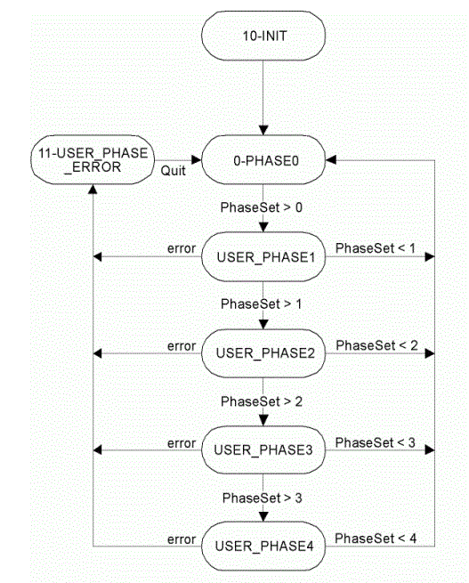

# State

## General

|  |  |
| --- | --- |
| Type | AD |
| Devices supporting the parameter | PacDrive LMC x00C,  PacDrive LMC x01C |
| Traceable | Yes |

## Functional Description

This parameter provides information about the operating status of the Sercos interface. There are various Sercos bus operating modes:

* Normal bus operation

The "operating mode controller" implements the operating modes. The State parameter contains the current state.

| Value | Designation | Meaning |
| --- | --- | --- |
| 0 | Phase 0 | Configuration and start up |
| 1 | Phase 1 | Normal operation, Sercos phase 1 |
| 2 | Phase 2 | Normal operation, Sercos phase 2 |
| 3 | Phase 3 | Normal operation, Sercos phase 3 |
| 4 | Phase 4 | Normal operation, Sercos phase 4 |
| 6 |  | Currently not used. |
| 8 |  | Currently not used. |
| 9 |  | Currently not used. |
| 10 | Init | Occurs only briefly during the booting of the system. |
| 11 | Error | A Sercos error has occurred in the operating phase. |

Simplified state diagram of the Sercos interface parameter State

Events of the state diagram of the Sercos interface parameter State

| Event | Meaning |
| --- | --- |
| PhaseSet | Parameter PhaseSet possible values 1...4 |
| Error | Sercos error |
| Quit | Diagnostic acknowledgment |

EIO0000002335.11