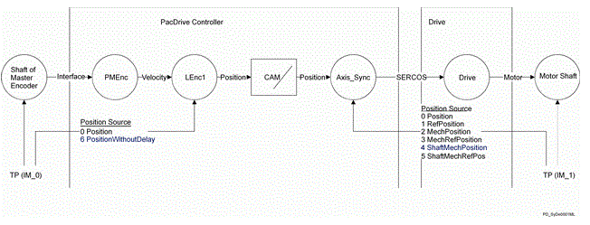

# PositionWithoutDelay

## General

|  |  |
| --- | --- |
| Type | AD |
| Devices supporting the parameter | Log. encoder |
| Traceable | Yes |

## Functional Description

Displays the position of the logical axis without considering the parameter Delay.

PositionWithoutDelay does not consider manipulation by the Delay parameter of the logical encoder. This allows the "real" position of a physical encoder (e.g. ) to be used for the TouchProbe function, even though a value (-ShaftRefDelay of the axis) is entered for the Synchronous run of a slave axis in the Delay parameter.

Use of PositionWithoutDelay with Touchprobe on master encoder and synchronous run of a slave axis for this master encoder

EIO0000002335.11