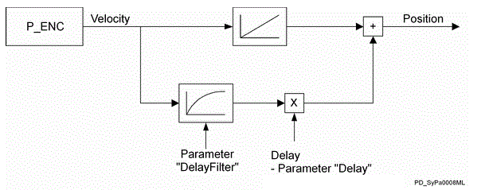

# DelayFilter

## General

|  |  |
| --- | --- |
| Type | EF |
| Devices supporting the parameter | Log. encoder |
| Traceable | Yes |

## Functional Description

For an external encoder, there is often no reason to directly filter the velocity signal since the Filter also reduces the dynamics of the velocity data signal. If dead-time compensation is used, the raw velocity signal often leads to additional amplification of the interfering signal in the downstream logical encoder. The dead time compensation of the logical encoder is made by the system.

Using the parameter DelayFilter, the velocity signal can be smoothed for dead time compensation. However, this is associated with a dynamic loss of dead time compensation.

Simplified representation of the effects of the DelayFilter parameter of the Log. encoder

The filter time is set in ms. The input value is rounded down internally to the next power of two. The maximum allowed value is dependent on the CycleTime parameter.

* CycleTime 1 -> maximum value 128
* CycleTime 2 ms -> maximum value 256
* CycleTime 4 ms -> maximum value 512

## Example

Filter = 40 ms / CycleTime = 2 ms

-> internal time constant of the filter = 32 ms

-> maximum value 256 was not reached

EIO0000002335.11