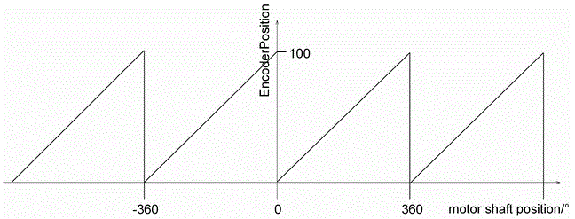

# EncoderPosition

## General

|  |  |
| --- | --- |
| Type | AF |
| Devices supporting the parameter | Encoder network (Synchronization encoder output, Synchronization encoder output) |
| Traceable | No |

## Functional Description

Displays the current position of the Synchronization encoder output or the Synchronization encoder input. The value range runs from 0 to FeedConstant.

The encoder position does not depend on the parameter *Direction*. Enabling the Synchronization encoder output sets the current encoder position to 0.

NOTE: The EncoderPosition is not changed by Setpos (for example, *FC\_SetposSingle()*, *FC\_SetposDual()*, *FC\_SetposGroup()* ).

## Example

FeedConstant = 100 units/revolution

Diagram of the parameter EncoderPosition of a Synchronization encoder output

EIO0000002335.11