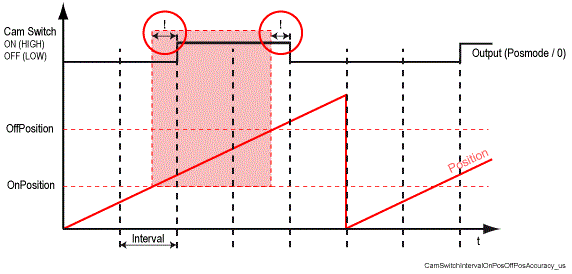
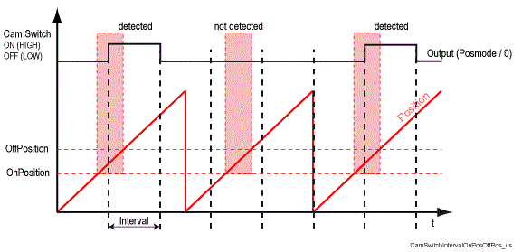

# Interval

## General

|  |  |
| --- | --- |
| Type | EF |
| Devices supporting the parameter | Cam switch group |
| Traceable | No |

## Functional Description

Displays the interval time (or cycle time) of the internal processing of the cam switch group.

If the interval is not a multiple of the system clock (250 µs or 1 ms), it is rounded to the next possible smaller interval. A change to the parameter takes effect immediately.

The precision of the switching position depends on the interval time and the current velocity of the [position source](D-SE-0077273.html#D-SE-0077273).

The precision of the cams depends on the parameter Interval and the velocity of the position source

On expiry of the respective interval time, the cam switch group checks the position values (scanning). That is, in the case of a greater interval time and for high velocities the cam switch group only recognizes correspondingly significant changes in position. This may cause a cam not to be detected between two scans.

Therefore, the following applies to the setting of the interval:

* The activation window (OnPosition and OffPosition including compensation periods OnDelay and OffDelay) must have a width of at least one interval, as otherwise cams will not be detected and the output (actor) is not actuated.
* The width of the activation window must be suitable for the velocity of the position source.
* The loading of the PacDrive system must be considered.

NOTE: The smaller the interval time, the higher the system utilization. Program processing is delayed (Cycle time may be exceeded).

Select the interval time according to your accuracy requirement for the cam switch group.

You can begin with a larger interval time. After checking the run time behavior of the real-time process (parameter CycleLoad) and the program tasks (Task.Load), the time interval of the cam switch group may be reduced in steps, if necessary.

## Example

* Interval = 10 ms
* OnPosition = 10 degrees
* OffPosition = 20 degrees
* OnDelay = 0 ms
* OffDelay = 0 ms
* Velocity of the position source = 2000 degrees/s

-> activation window is (20-10) / 2000 s = 5 ms wide. That is, the position is in the activation window for only 5 ms.

-> With an interval of 10 ms the cam is not reliably detected.

Incorrect setting of the parameter Interval of the cam switch group

## Improving Precision

A minimum value of 50 µs is possible. To this end, the parameter Systemticks must also be correspondingly planned (Systemticks = 20000).

NOTE: The function may only be used by experienced users after consultation with your contact person.

The parameter CamSwitchGroup Priority = must be set to "higher RTP / 2 " in order to be able to work with this accuracy (with a higher priority than the real-time process). This can significantly affect the real-time behavior of the system, however.

## Example

* Interval = 300
* Systemticks = 4000 (System cycle = 250 µs)

**->** Interval = 250

EIO0000002335.11