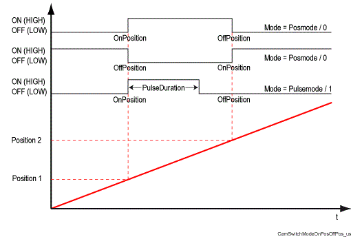

# Mode

## General

|  |  |
| --- | --- |
| Type | EF |
| Devices supporting the parameter | Cam switch |
| Traceable | Yes |

## Functional Description

Selects the cam switch mode. The cam can be operated in position mode or in pulse mode.

| Value | Data type | Meaning |
| --- | --- | --- |
| Posmode / 0 | DINT | The output of a cam is set for as long as the current position is within the activation window (OnPosition and OffPosition) of the cam. |
| Pulsemode / 1 | DINT | When entering the activation window (OnPosition and OffPosition) the output is enabled. The output remains enabled until the time specified at PulseDuration has expired. A "comparison" is executed only after the activation window has been exited and "entered" again. |

Correlation of the parameters Mode, OnPosition, OffPosition and PulseDuration of the CamSwitch

The activation window may be restricted by OnDelay / OffDelay times.

EIO0000002335.11